# Keyestudio Beetlebot 3 in 1 Robot for Arduino STEM Education

## Description：

The Beetlebot smart robot, compatible with LEGO building blocks, is a STEM
educational product which can automatically dodge obstacles, follow black lines
and light to move. Besides, it has three cool forms such as the soccer robot,
the siege robot, the handling robot. As for beginners, they can create whatever
they want by LEGO building blocks.

Various improvements have been made on the Beetlebot car in comparison with
other smart cars. It integrates a motor driver and a large number of sensors and
is easy to assemble.

Going forward, not only can it impart basic programming knowledge and AI
application to children and the youth, but also it can cultivate their
creativity, hands-on ability, problem-solving capability, interpersonal
communication as well as teamwork ability. With this kit, you have a chance to
experience soccer games using your own robots.

## Features：

Compatible with LEGO building blocks: generate diverse forms with LEGO blocks
and sensors

Three forms: a soccer robot, a siege engine, a handling robot

Various functions: Pictures display, atmosphere light control, line tracking,
obstacle avoidance, light following , IR control and WIFI control.

Easy to build: embedded design on car body; wire up the car body with a few
steps

High compatibility: reserve ports for the Raspberry Pico board and the ESP32
control board

Charging function: integrate a circuit for 18650 batteries, low-cost and
effective

WiFi Control: adopt WiFi control, can finish tailor-made software development

App: compatible with Android and iOS systems, with aesthetic page and flexible
control system

## Specification：

Working voltage: 5V

Input voltage: 2.5V\~4.2V (lithium battery)

Maximum output current: 3A

Maximum power consumption: 15W (T=80℃)

Motor speed: 5V 200 rpm / min

Motor drive form: dual H-bridge

Ultrasonic sensing angle: \<15 degrees

Ultrasonic detection distance: 2cm-400cm

IR control distance: about 7 meters (measured)

Size: 176mm\*137mm\*130mm

Environmental protection attributes: ROHS

## Kit List：

| \# | Picture                                                                                             | Name                                                                                                                                                                                                                                                                                                                                                                                                                                                                                                                                                                                                                                                                                                                                                                                                                                                                                                                                                                                                                                                                                                                                                                                    | QTY |
|----|-----------------------------------------------------------------------------------------------------|-----------------------------------------------------------------------------------------------------------------------------------------------------------------------------------------------------------------------------------------------------------------------------------------------------------------------------------------------------------------------------------------------------------------------------------------------------------------------------------------------------------------------------------------------------------------------------------------------------------------------------------------------------------------------------------------------------------------------------------------------------------------------------------------------------------------------------------------------------------------------------------------------------------------------------------------------------------------------------------------------------------------------------------------------------------------------------------------------------------------------------------------------------------------------------------------|-----|
|    |                                                      | Keyestudio Nano CH340 Development Board                                                                                                                                                                                                                                                                                                                                                                                                                                                                                                                                                                                                                                                                                                                                                                                                                                                                                                                                                                                                                                                                                                                                                 | 1   |
|    |                                                    | ESP8266 Wifi Module                                                                                                                                                                                                                                                                                                                                                                                                                                                                                                                                                                                                                                                                                                                                                                                                                                                                                                                                                                                                                                                                                                                                                                     | 1   |
|    |                                                 | Keyestudio Photoresistor                                                                                                                                                                                                                                                                                                                                                                                                                                                                                                                                                                                                                                                                                                                                                                                                                                                                                                                                                                                                                                                                                                                                                                | 2   |
|    |                                                    | 270° Servo                                                                                                                                                                                                                                                                                                                                                                                                                                                                                                                                                                                                                                                                                                                                                                                                                                                                                                                                                                                                                                                                                                                                                                              | 1   |
|    |                                                    | Keyestudio Development Board                                                                                                                                                                                                                                                                                                                                                                                                                                                                                                                                                                                                                                                                                                                                                                                                                                                                                                                                                                                                                                                                                                                                                            | 1   |
|    | 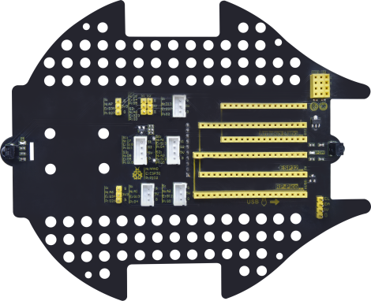                                                   | Keyestudio Driver Board                                                                                                                                                                                                                                                                                                                                                                                                                                                                                                                                                                                                                                                                                                                                                                                                                                                                                                                                                                                                                                                                                                                                                                 | 1   |
|    |                                                    | LEGO Bulk Lot                                                                                                                                                                                                                                                                                                                                                                                                                                                                                                                                                                                                                                                                                                                                                                                                                                                                                                                                                                                                                                                                                                                                                                           | 1   |
|    | 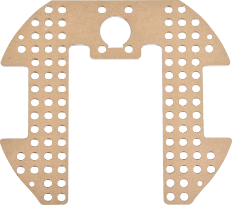                                                   | Acrylic Board                                                                                                                                                                                                                                                                                                                                                                                                                                                                                                                                                                                                                                                                                                                                                                                                                                                                                                                                                                                                                                                                                                                                                                           | 1   |
|    |                                                    | MD0487 Acrylic Board for Ultrasonic Sensor                                                                                                                                                                                                                                                                                                                                                                                                                                                                                                                                                                                                                                                                                                                                                                                                                                                                                                                                                                                                                                                                                                                                              | 1   |
|    |                                                     | Acrylic Board for Servo                                                                                                                                                                                                                                                                                                                                                                                                                                                                                                                                                                                                                                                                                                                                                                                                                                                                                                                                                                                                                                                                                                                                                                 | 1   |
|    |                                                     | 4.5V 200R Motor                                                                                                                                                                                                                                                                                                                                                                                                                                                                                                                                                                                                                                                                                                                                                                                                                                                                                                                                                                                                                                                                                                                                                                         | 2   |
|    |                                                    | 8\*8 Dot Matrix Display                                                                                                                                                                                                                                                                                                                                                                                                                                                                                                                                                                                                                                                                                                                                                                                                                                                                                                                                                                                                                                                                                                                                                                 | 1   |
|    |                                                     |  Aluminum Block | 2   |
|    |                                                    | 9G 180°Servo                                                                                                                                                                                                                                                                                                                                                                                                                                                                                                                                                                                                                                                                                                                                                                                                                                                                                                                                                                                                                                                                                                                                                                            | 1   |
|    |                                                    | Car Wheel                                                                                                                                                                                                                                                                                                                                                                                                                                                                                                                                                                                                                                                                                                                                                                                                                                                                                                                                                                                                                                                                                                                                                                               | 2   |
|    | 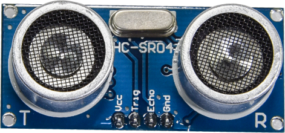                                                    | HC-SR04 Ultrasonic Sensor                                                                                                                                                                                                                                                                                                                                                                                                                                                                                                                                                                                                                                                                                                                                                                                                                                                                                                                                                                                                                                                                                                                                                               | 1   |
|    |                                                    | Screwdriver     | 1   |
|    | 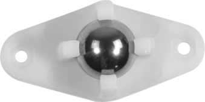                                                    | W420 Universal Wheel                                                                                                                                                                                                                                                                                                                                                                                                                                                                                                                                                                                                                                                                                                                                                                                                                                                                                                                                                                                                                                                                                                                                                                    | 1   |
|    |                                              | JMFP-4 17-Key Remote Control                                                                                                                                                                                                                                                                                                                                                                                                                                                                                                                                                                                                                                                                                                                                                                                                                                                                                                                                                                                                                                                                                                                                                            | 1   |
|    |                                                     | Black USB Cable                                                                                                                                                                                                                                                                                                                                                                                                                                                                                                                                                                                                                                                                                                                                                                                                                                                                                                                                                                                                                                                                                                                                                                         | 1   |
|    |                                                | Screwdriver                                                                                                                                                                                                                                                                                                                                                                                                                                                                                                                                                                                                                                                                                                                                                                                                                                                                                                                                                                                                                                                                                                                                                                             | 1   |
|    |                                                     | 3P F-F Dupont Wire                                                                                                                                                                                                                                                                                                                                                                                                                                                                                                                                                                                                                                                                                                                                                                                                                                                                                                                                                                                                                                                                                                                                                                      | 2   |
|    |                                                     | 4P F-F Dupont Wire                                                                                                                                                                                                                                                                                                                                                                                                                                                                                                                                                                                                                                                                                                                                                                                                                                                                                                                                                                                                                                                                                                                                                                      | 1   |
|    |                                                     | HX2.54mm-4P Dupont Wire                                                                                                                                                                                                                                                                                                                                                                                                                                                                                                                                                                                                                                                                                                                                                                                                                                                                                                                                                                                                                                                                                                                                                                 | 1   |
|    |                                             | Winding Pipe                                                                                                                                                                                                                                                                                                                                                                                                                                                                                                                                                                                                                                                                                                                                                                                                                                                                                                                                                                                                                                                                                                                                                                            | 1   |
|    | 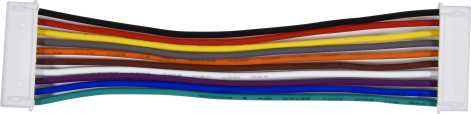                                                   | 10P XH2.54 Dupont Wire                                                                                                                                                                                                                                                                                                                                                                                                                                                                                                                                                                                                                                                                                                                                                                                                                                                                                                                                                                                                                                                                                                                                                                  | 1   |
|    |                                                    | Acrylic Gasket                                                                                                                                                                                                                                                                                                                                                                                                                                                                                                                                                                                                                                                                                                                                                                                                                                                                                                                                                                                                                                                                                                                                                                          | 6   |
|    |                                                    | M3\*40MM Dual Pass Copper Pillars                                                                                                                                                                                                                                                                                                                                                                                                                                                                                                                                                                                                                                                                                                                                                                                                                                                                                                                                                                                                                                                                                                                                                       | 4   |
|    |                                                    | M1.2\*5MM Round Head Screws                                                                                                                                                                                                                                                                                                                                                                                                                                                                                                                                                                                                                                                                                                                                                                                                                                                                                                                                                                                                                                                                                                                                                             | 6   |
|    |   | M1.4 Nuts                                                                                                                                                                                                                                                                                                                                                                                                                                                                                                                                                                                                                                                                                                                                                                                                                                                                                                                                                                                                                                                                                                                                                                               | 6   |
|    |                                                      | M1.4\*10MM Round Head Screws                                                                                                                                                                                                                                                                                                                                                                                                                                                                                                                                                                                                                                                                                                                                                                                                                                                                                                                                                                                                                                                                                                                                                            | 6   |
|    |                                                    | M2 Nuts                                                                                                                                                                                                                                                                                                                                                                                                                                                                                                                                                                                                                                                                                                                                                                                                                                                                                                                                                                                                                                                                                                                                                                                 | 3   |
|    | 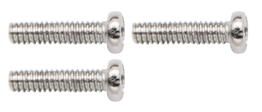                                                   | M2\*8MM Round Head Screws                                                                                                                                                                                                                                                                                                                                                                                                                                                                                                                                                                                                                                                                                                                                                                                                                                                                                                                                                                                                                                                                                                                                                               | 3   |
|    |   | M3\*10MM Round Head Screws                                                                                                                                                                                                                                                                                                                                                                                                                                                                                                                                                                                                                                                                                                                                                                                                                                                                                                                                                                                                                                                                                                                                                              | 6   |
|    |                                                      | M3\*6MM Round Head Screws                                                                                                                                                                                                                                                                                                                                                                                                                                                                                                                                                                                                                                                                                                                                                                                                                                                                                                                                                                                                                                                                                                                                                               | 11  |
|    |                                                    | M3 Nuts                                                                                                                                                                                                                                                                                                                                                                                                                                                                                                                                                                                                                                                                                                                                                                                                                                                                                                                                                                                                                                                                                                                                                                                 | 9   |
|    | 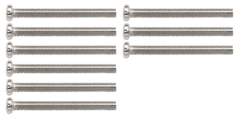                                                   | M3\*30MM Round Head Screws                                                                                                                                                                                                                                                                                                                                                                                                                                                                                                                                                                                                                                                                                                                                                                                                                                                                                                                                                                                                                                                                                                                                                              | 4   |
|    |                                                     | Soccer Ball                                                                                                                                                                                                                                                                                                                                                                                                                                                                                                                                                                                                                                                                                                                                                                                                                                                                                                                                                                                                                                                                                                                                                                             | 1   |
|    | 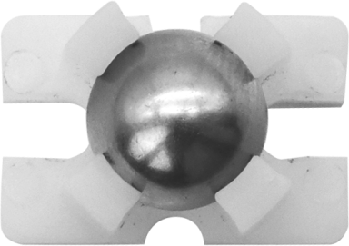                                                   | W1515 Universal Wheel                                                                                                                                                                                                                                                                                                                                                                                                                                                                                                                                                                                                                                                                                                                                                                                                                                                                                                                                                                                                                                                                                                                                                                   | 1   |
|    |                                                    | 18650 Batteries KS0543F includes batteries KS0543 doesn't conclude batteries                                                                                                                                                                                                                                                                                                                                                                                                                                                                                                                                                                                                                                                                                                                                                                                                                                                                                                                                                                                                                                                                                                            | 1   |
|    |                                               |  USB to ESP-01S WIFI Module Expansion Board                                                                                                                                                                                                                                                                                                                                                                                                                                                                                                                                                                                                                                                                                                                                                                                                                                                                                                                                                                                                                                                                                                                                             | 1   |

## How to install the Beetlebot car：

## How to add libraries：

In terms of adding libraries, you can refer to the“Get started with
Arduino”folder.

Libraries must be added; otherwise, the test code can’t be uploaded to the
Arduino Nano board.

If you added them, just skip this step.

## PCB Board：

Turn the DIP switch to the OFF end before installing or removing batteries

Arduino Libraries and the CH340 Driver：

Refer to the Get started with Arduino folder to gain access to more details
about adding libraries and the CH340 driver

If Arduino libraries and the CH340 driver are added, just skip this step.

## Projects：

### Project 1: LED Blinking

Description：

There is an onboard LED (L) on our Arduino Nano board connected to D13. In this
experiment, we WILL make this LED blink.

LED blinking is the most basic experimental project for Arduino enthusiasts.
Let’s get started.

Knowledge：

On-board LED：

LED, the abbreviation of light emitting diodes, consists of Ga, As, P, N
chemical compounds and so on. It is easy to control through the IO port(D13) of
the Arduino Nano board.

Test Code：

/*
  Project 01 LED Blinking
  Turns an LED on for one second, then off for one second, repeatedly.
*/
int ledPin=13; //Define LED pin to D13
// the setup function runs once when you press reset or power the board

void setup() {
  // initialize digital pin LED_BUILTIN as an output.
  pinMode(ledPin, OUTPUT);
}

// the loop function runs over and over again forever
void loop() {
  digitalWrite(ledPin, HIGH);   // turn the LED on (HIGH is the voltage level)
  delay(1000);                       // wait for a second
  digitalWrite(ledPin, LOW);    // turn the LED off by making the voltage LOW
  delay(1000);                       // wait for a second
}

Test Result：

Upload the test code to the Arduino Nano board and power up with a USB cable.
Then the on-board LED will flash.

### Project 2: 6812 RGB

Description：

There are 4 RGB LEDs can be widely used in the decoration of buildings, bridges,
roads, gardens, courtyards and so on by colors adjustment.

In this experiment, we will demonstrate different lighting effects with them.

2\. Knowledge：

Working Principle

From the schematic diagram, we can see that these four pixel lighting beads are
all connected in series. In fact, no matter how many they are, we can use a pin
to control a light and let it display any color. The pixel point contains a data
latch signal shaping amplifier drive circuit, a high-precision internal
oscillator and a 12V high-voltage programmable constant current control part,
which effectively ensures the color of the pixel point light is highly
consistent.

The data protocol adopts a single-wire zero-code communication method. After the
pixel is powered up and reset, the S terminal receives the data transmitted from
the controller. The first 24bit data sent is extracted by the first pixel and
sent to the data latch of the pixel.

3\. Test Code：

The SK6812RGB on the PCB board is controlled by the IO port (A3)

/*
  Project 02 SK6812 RGB
  4 RGBs for various lighting effects.
*/
#include <Adafruit_NeoPixel.h>

#define PIN A3

// Parameter 1 = number of pixels in strip
// Parameter 2 = Arduino pin number (most are valid)
// Parameter 3 = pixel type flags, add together as needed:
//   NEO_KHZ800  800 KHz bitstream (most NeoPixel products w/WS2812 LEDs)
//   NEO_KHZ400  400 KHz (classic 'v1' (not v2) FLORA pixels, WS2811 drivers)
//   NEO_GRB     Pixels are wired for GRB bitstream (most NeoPixel products)
//   NEO_RGB     Pixels are wired for RGB bitstream (v1 FLORA pixels, not v2)
Adafruit_NeoPixel strip = Adafruit_NeoPixel(60, PIN, NEO_GRB + NEO_KHZ800);

// IMPORTANT: To reduce NeoPixel burnout risk, add 1000 uF capacitor across
// pixel power leads, add 300 - 500 Ohm resistor on first pixel's data input
// and minimize distance between Arduino and first pixel.  Avoid connecting
// on a live circuit...if you must, connect GND first.

void setup() {
  strip.begin();
  strip.show(); // Initialize all pixels to 'off'
}

void loop() {
  // Some example procedures showing how to display to the pixels:
  colorWipe(strip.Color(255, 0, 0), 50); // Red
  colorWipe(strip.Color(0, 255, 0), 50); // Green
  colorWipe(strip.Color(0, 0, 255), 50); // Blue
  // Send a theater pixel chase in...
  theaterChase(strip.Color(127, 127, 127), 50); // White
  theaterChase(strip.Color(127,   0,   0), 50); // Red
  theaterChase(strip.Color(  0,   0, 127), 50); // Blue

  rainbow(20);
  rainbowCycle(20);
  theaterChaseRainbow(50);
}

// Fill the dots one after the other with a color
void colorWipe(uint32_t c, uint8_t wait) {
  for(uint16_t i=0; i<strip.numPixels(); i++) {
      strip.setPixelColor(i, c);
      strip.show();
      delay(wait);
  }
}

void rainbow(uint8_t wait) {
  uint16_t i, j;

  for(j=0; j<256; j++) {
    for(i=0; i<strip.numPixels(); i++) {
      strip.setPixelColor(i, Wheel((i+j) & 255));
    }
    strip.show();
    delay(wait);
  }
}

// Slightly different, this makes the rainbow equally distributed throughout
void rainbowCycle(uint8_t wait) {
  uint16_t i, j;

  for(j=0; j<256*5; j++) { // 5 cycles of all colors on wheel
    for(i=0; i< strip.numPixels(); i++) {
      strip.setPixelColor(i, Wheel(((i * 256 / strip.numPixels()) + j) & 255));
    }
    strip.show();
    delay(wait);
  }
}

//Theatre-style crawling lights.
void theaterChase(uint32_t c, uint8_t wait) {
  for (int j=0; j<10; j++) {  //do 10 cycles of chasing
    for (int q=0; q < 3; q++) {
      for (int i=0; i < strip.numPixels(); i=i+3) {
        strip.setPixelColor(i+q, c);    //turn every third pixel on
      }
      strip.show();
     
      delay(wait);
     
      for (int i=0; i < strip.numPixels(); i=i+3) {
        strip.setPixelColor(i+q, 0);        //turn every third pixel off
      }
    }
  }
}

//Theatre-style crawling lights with rainbow effect
void theaterChaseRainbow(uint8_t wait) {
  for (int j=0; j < 256; j++) {     // cycle all 256 colors in the wheel
    for (int q=0; q < 3; q++) {
        for (int i=0; i < strip.numPixels(); i=i+3) {
          strip.setPixelColor(i+q, Wheel( (i+j) % 255));    //turn every third pixel on
        }
        strip.show();
       
        delay(wait);
       
        for (int i=0; i < strip.numPixels(); i=i+3) {
          strip.setPixelColor(i+q, 0);        //turn every third pixel off
        }
    }
  }
}

// Input a value 0 to 255 to get a color value.
// The colours are a transition r - g - b - back to r.
uint32_t Wheel(byte WheelPos) {
  if(WheelPos < 85) {
   return strip.Color(WheelPos * 3, 255 - WheelPos * 3, 0);
  } else if(WheelPos < 170) {
   WheelPos -= 85;
   return strip.Color(255 - WheelPos * 3, 0, WheelPos * 3);
  } else {
   WheelPos -= 170;
   return strip.Color(0, WheelPos * 3, 255 - WheelPos * 3);
  }
}

4\. Test Result：

Upload the test code to the Arduino Nano board and power up by a USB cable. Then
the four RGB lights on the PCB demonstrate multi-color light effect.

### Project 3: Play Music

Description：

There is a power amplifier component on the expansion board, which is often used
to play music and serve as an external amplifying device for music playback
devices.

In this experiment, we use the speaker amplifier component to play music.

2\. Knowledge：

Power amplifier modules(equivalent to a passive buzzer) don’t have internal
oscillation circuits.

The power amplifier module can chime sounds with different frequency when power
it up.

3\. Test Code：

The speaker component on the PCB board is controlled by the D3 of the Arduino
Nano board.

/*
Project 03 Buzzer
Buzzer plays music
*/
#define NOTE_B0  31
#define NOTE_C1  33
#define NOTE_CS1 35
#define NOTE_D1  37
#define NOTE_DS1 39
#define NOTE_E1  41
#define NOTE_F1  44
#define NOTE_FS1 46
#define NOTE_G1  49
#define NOTE_GS1 52
#define NOTE_A1  55
#define NOTE_AS1 58
#define NOTE_B1  62
#define NOTE_C2  65
#define NOTE_CS2 69
#define NOTE_D2  73
#define NOTE_DS2 78
#define NOTE_E2  82
#define NOTE_F2  87
#define NOTE_FS2 93
#define NOTE_G2  98
#define NOTE_GS2 104
#define NOTE_A2  110
#define NOTE_AS2 117
#define NOTE_B2  123
#define NOTE_C3  131
#define NOTE_CS3 139
#define NOTE_D3  147
#define NOTE_DS3 156
#define NOTE_E3  165
#define NOTE_F3  175
#define NOTE_FS3 185
#define NOTE_G3  196
#define NOTE_GS3 208
#define NOTE_A3  220
#define NOTE_AS3 233
#define NOTE_B3  247
#define NOTE_C4  262
#define NOTE_CS4 277
#define NOTE_D4  294
#define NOTE_DS4 311
#define NOTE_E4  330
#define NOTE_F4  349
#define NOTE_FS4 370
#define NOTE_G4  392
#define NOTE_GS4 415
#define NOTE_A4  440
#define NOTE_AS4 466
#define NOTE_B4  494
#define NOTE_C5  523
#define NOTE_CS5 554
#define NOTE_D5  587
#define NOTE_DS5 622
#define NOTE_E5  659
#define NOTE_F5  698
#define NOTE_FS5 740
#define NOTE_G5  784
#define NOTE_GS5 831
#define NOTE_A5  880
#define NOTE_AS5 932
#define NOTE_B5  988
#define NOTE_C6  1047
#define NOTE_CS6 1109
#define NOTE_D6  1175
#define NOTE_DS6 1245
#define NOTE_E6  1319
#define NOTE_F6  1397
#define NOTE_FS6 1480
#define NOTE_G6  1568
#define NOTE_GS6 1661
#define NOTE_A6  1760
#define NOTE_AS6 1865
#define NOTE_B6  1976
#define NOTE_C7  2093
#define NOTE_CS7 2217
#define NOTE_D7  2349
#define NOTE_DS7 2489
#define NOTE_E7  2637
#define NOTE_F7  2794
#define NOTE_FS7 2960
#define NOTE_G7  3136
#define NOTE_GS7 3322
#define NOTE_A7  3520
#define NOTE_AS7 3729
#define NOTE_B7  3951
#define NOTE_C8  4186
#define NOTE_CS8 4435
#define NOTE_D8  4699
#define NOTE_DS8 4978
#define REST 0
int tempo=114; // change this to make the song slower or faster
int buzzer = 3;// initializes digital I/O PIN to control the buzzer
// notes of the moledy followed by the duration
// a 4 means a quarter note, 8 an eighteenth , 16 sixteenth, so on
//  !!negative numbers are used to represent dotted notes
//  so -4 means a dotted quarter note, that is, a quarter plus an eighteenth
int melody[] = {
  NOTE_E4,4,  NOTE_E4,4,  NOTE_F4,4,  NOTE_G4,4,//1
  NOTE_G4,4,  NOTE_F4,4,  NOTE_E4,4,  NOTE_D4,4,
  NOTE_C4,4,  NOTE_C4,4,  NOTE_D4,4,  NOTE_E4,4,
  NOTE_E4,-4, NOTE_D4,8,  NOTE_D4,2,
  NOTE_E4,4,  NOTE_E4,4,  NOTE_F4,4,  NOTE_G4,4,//4
  NOTE_G4,4,  NOTE_F4,4,  NOTE_E4,4,  NOTE_D4,4,
  NOTE_C4,4,  NOTE_C4,4,  NOTE_D4,4,  NOTE_E4,4,
  NOTE_D4,-4,  NOTE_C4,8,  NOTE_C4,2,
  NOTE_D4,4,  NOTE_D4,4,  NOTE_E4,4,  NOTE_C4,4,//8
  NOTE_D4,4,  NOTE_E4,8,  NOTE_F4,8,  NOTE_E4,4, NOTE_C4,4,
  NOTE_D4,4,  NOTE_E4,8,  NOTE_F4,8,  NOTE_E4,4, NOTE_D4,4,
  NOTE_C4,4,  NOTE_D4,4,  NOTE_G3,2,
  NOTE_E4,4,  NOTE_E4,4,  NOTE_F4,4,  NOTE_G4,4,//12
  NOTE_G4,4,  NOTE_F4,4,  NOTE_E4,4,  NOTE_D4,4,
  NOTE_C4,4,  NOTE_C4,4,  NOTE_D4,4,  NOTE_E4,4,
  NOTE_D4,-4,  NOTE_C4,8,  NOTE_C4,2
};
// sizeof gives the number of bytes, each int value is composed of two bytes (16 bits)
// there are two values per note (pitch and duration), so for each note there are four bytes
int notes=sizeof(melody)/sizeof(melody[0])/2; 
// this calculates the duration of a whole note in ms (60s/tempo)*4 beats
int wholenote = (60000 * 4) / tempo;
int divider = 0, noteDuration = 0;
void setup() {
  // iterate over the notes of the melody
  // remember, the array is twice the number of notes (notes + durations)
  for (int thisNote = 0; thisNote < notes * 2; thisNote = thisNote + 2) {
    // calculates the duration of each note
    divider = melody[thisNote + 1];
    if (divider > 0) {
    noteDuration = (wholenote) / divider; // regular note, just proceed
    } else if (divider < 0) {
      // dotted notes are represented with negative durations!!
      noteDuration = (wholenote) / abs(divider);
      noteDuration *= 1.5; // increases the duration in half for dotted notes
    }
    // we only play the note for 90% of the duration, leaving 10% as a pause
    tone(buzzer, melody[thisNote], noteDuration*0.9);
  // Wait for the specief duration before playing the next note
    delay(noteDuration);
    noTone(buzzer);  //  stop the waveform generation before the next note
  }
}
void loop() {
// if you want to repeat the song forever, 
// just paste the setup code here instead.
}

4\. Test Result：

Upload the test code to the Arduino Nano board and power up with a USB cable.
Then the power amplifier component will play music

### Project 4: 8\*8 Dot Matrix

Description：

Composed of LED emitting tube diodes, the 8\*8 LED dot matrix are applied widely
to public information display like advertisement screen and bulletin board, by
controlling LED to show words, pictures and videos, etc.

There are different types of matrices, including 4×4, 8×8 and 16×16 and etc. It
contains 64 LEDs.

The inner structure of 8×8 dot matrix is shown below.

Every LED is installed on the cross point of row line and column line. When the
voltage on a row line increases, and the voltage on the column line reduces, the
LED on the cross point will light up. 8×8 dot matrix has 16 pins. Put the
silk-screened side down and the numbers are 1, 8, 9 and 16 in anticlockwise
order as marked below.

The definition inner pins are shown below:

For instance, to light up the LED on row 1 and column 1, you should increase the
voltage of pin 9 and reduce the voltage of pin 13.

HT16K33 8X8 Dot Matrix

The HT16K33 is a memory mapping and multi-purpose LED controller driver. The
max. Display segment numbers in the device is 128 patterns (16 segments and 8
commons) with a 13\*3 (MAX.) matrix key scan circuit. The software configuration
features of the HT16K33 makes it suitable for multiple LED applications
including LED modules and display subsystems. The HT16K33 is compatible with
most microcontrollers and communicates via a two-line bidirectional I2C-bus.

The picture below is the working schematic of HT16K33 chip

We design the drive module of 8\*8 dot matrix based on the above principle. We
could control the dot matrix by I2C communication and two pins of
microcontroller, according to the above diagram.

3\. Specification:

Input voltage: 5V

Rated input frequency: 400KHZ

Input power: 2.5W

Input current: 500mA

4\. Introduction for Modulus Tool

The online version of dot matrix modulus tool:

[http://dotmatrixtool.com/\#](http://dotmatrixtool.com/)

①Open the link to enter the following page.

②The dot matrix is 8\*8 in this project. So set the height to 8, width to 8; as
shown below.

③Click Byte order to select Row major

③ Generate hexadecimal data from the pattern

As shown below, the left button of the mouse is for selection while the right is
for canceling. Thus you could use them to draw the pattern you want, then click
Generate, to yield the hexadecimal data needed.

The generated hexadecimal code（0x00, 0x66, 0x00, 0x00, 0x18, 0x42, 0x3c, 0x00)
is what will be displayed, so you need to save it for next procedure.

Wiring up：

| 8\*8 Dot matrix display | PCB Board |
|-------------------------|-----------|
| G                       | G         |
| 5V                      | 5V        |
| SDA                     | SDA       |
| SCL                     | SCL       |

6\. Test Code：

The 8\*8 dot matrix is controlled by A4（SDA）and A5（SCL）of the Arduino Nano
board.

/*
 Project 04 8*8 Dot Matrix
 8*8 dot matrix screen to display patterns
*/ 
#include <ks_Matrix.h>
Matrix myMatrix(A4,A5);    //set pins to communication pins
// define an array
uint8_t LedArray1[8]={0x00, 0x66, 0x00, 0x00, 0x18, 0x42, 0x3c, 0x00};  
uint8_t  LEDArray[8]; //define an array(by modulus tool) without initial value

void setup(){
  myMatrix.begin(0x70);  //communication address
  myMatrix.clear();    //clear matrix
}

void loop(){
  for(int i=0; i<8; i++)  // there is eight data, loop for eight times
  {
LEDArray[i]=LedArray1[i];  //Call the emoticon array data in the subroutine LEDArray
for(int j=7; j>=0; j--)  //Every data(byte) has 8 bit, therefore, loop for eight times
    {
      if((LEDArray[i]&0x01)>0) //judge if the last bit of data is greater than 0
      {
        myMatrix.drawPixel(j, i,1);  //light up the corresponding point
      }
      else  //otherwise
      {
        myMatrix.drawPixel(j, i,0);  //turn off the corresponding point
      }
      LEDArray[i] = LEDArray[i]>>1;  //LEDArray[i] moves right for one bit to judge the previous one bit
    }
  }
  myMatrix.writeDisplay();  // dot matrix shows
}

7\. Test Result：

Upload the test code to the Arduino Nano board and power up by a USB cable, the
8\*8 dot matrix display will show a“smile”pattern.

### Project 5: Servo Rotation

Description：

There are two servos on the car. We take the servo connected to pin D9 as an
example.

The servo is a motor that can rotate very accurately. It has been widely applied
to toy cars, remote control helicopters, airplanes, robots and other fields. In
this project, we will use the Nano motherboard to control the servo to spin.

Knowledge：

Servo motor is a position control rotary actuator. It mainly consists of a
housing, a circuit board, a core-less motor, a gear and a position sensor. Its
working principle is that the servo receives the signal sent by MCU or receiver
and produces a reference signal with a period of 20ms and width of 1.5ms, then
compares the acquired DC bias voltage to the voltage of the potentiometer and
obtain the voltage difference output.

When the motor speed is constant, the potentiometer is driven to rotate through
the cascade reduction gear, which leads that the voltage difference is 0, and
the motor stops rotating. Generally, the angle range of servo rotation is 0°
\--180 °

The rotation angle of servo motor is controlled by regulating the duty cycle of
PWM (Pulse-Width Modulation) signal. The standard cycle of PWM signal is 20ms
(50Hz). Theoretically, the width is distributed between 1ms-2ms, but in fact,
it's between 0.5ms-2.5ms. The width corresponds the rotation angle from 0° to
180°. But note that for different brand motors, the same signal may have
different rotation angles.

In general, servo has three lines in brown, red and orange. The brown wire is
grounded, the red one is a positive pole line and the orange one is a signal
line.

Wire up：

| Servo  | PCB Board |
|--------|-----------|
| Brown  | G         |
| Red    | 5V        |
| Orange | S1（D9）  |

Test Code：

The servo of the ultrasonic sensor is controlled by the GPIO9 of the Pico board.

/*
Project 05 Servo Rotation
the plastic arm of the servo will rotate at an angle of 0°, 45°, 90°, 135°, and 180°.
*/
#include <Servo.h>
Servo myservo;// define the name of the servo
void setup()
{
myservo.attach(9);// select the pin of the servo(9)
}
void loop()
{
myservo.write(0);// set the rotation angle of the motor
delay(500);
myservo.write(45);// set the rotation angle of the motor
delay(500);
myservo.write(90);// set the rotation angle of the motor
delay(500);
myservo.write(135);// set the rotation angle of the motor
delay(500);
myservo.write(180);// set the rotation angle of the motor
delay(500);
}

5\. Test Result：

Upload the test code to the Arduino Nano board, and power up with a USB cable.
Then the arm of the servo will rotate to 0°, 45°, 90°, 135° and 180°

### Project 6: Motor Driving and Speed Control

Description：

There are many ways to drive motors. This car uses the most commonly used
DRV8833 motor driver chip, which provides a dual-channel bridge electric driver
for toys, printers and other motor integration applications.

In this experiment, we use the DRV8833 motor driver chip on the expansion board
to drive the two DC motors, and demonstrate the effect of forward, backward,
left-turning, and right-turning.

Knowledge：

DRV8833 motor driver chip: Dual H-bridge motor driver with current control
function, can drive two DC motors, one bipolar stepper motor, solenoid valve or
other inductive loads. Each H-bridge includes circuitry to regulate or limit
winding current.

An internal shutdown function with a fault output pin is used for over-current
and short circuit protection, under-voltage lockout and over-temperature. A
low-power sleep mode is also added. Let's take a look at the schematic diagram
of the DRV8833 motor driver chip driving two DC motors:

If you want to get insight to it, you can check the specification of this chip.
Just browse it in the“Attachments”folder.

3\. Specification：

Input voltage of logic part: DC 5V

Input voltage of driving part : DC 5V

Working current of logic part: \<30mA

Operating current of driving part: \<2A

Maximum power dissipation: 10W (T=80℃)

Motor speed: 5V 200 rpm / min

Motor drive form: dual H-bridge drive

Control signal input level: high level 2.3V\<Vin\<5V, low level -0.3V\<Vin\<1.5V

Working temperature: -25\~130℃

4\. Drive the car to move

From the above diagram, the direction pin of the left motor is D4; the speed pin
is D6; D2 is the direction pin of the right motor; and D5 is speed pin.

PWM drives the robot car. The PWM value is in the range of 0-255. The more the
PWM value is set, the faster the rotation of the motor.

| Function   | D4   | D6（PWM） | Left motor    | D2   | D5（PWM） | Right motor   |
|------------|------|-----------|---------------|------|-----------|---------------|
| forward    | LOW  | 200       | clockwise     | LOW  | 200       | clockwise     |
| Go back    | HIGH | 50        | anticlockwise | HIGH | 50        | anticlockwise |
| Turn left  | HIGH | 200       | anticlockwise | LOW  | 200       | clockwise     |
| Turn right | LOW  | 200       | clockwise     | HIGH | 200       | anticlockwise |
| Stop       | LOW  | 0         | stop          | LOW  | 0         | stop          |

5\. Test Code：

/*
 Project 06 Motor drive and speed regulation
 Motor moves forward, backward, left and right
*/ 
const int left_ctrl = 4;//define the direction control pin(D4) of the left motor
const int left_pwm = 6;// define the speed control pin(D6) of the left motor
const int right_ctrl = 2;//define the direction control pin(D2) of the right motor
const int right_pwm = 5;//define the speed control pin(D5) of the right motor

void setup()
{
  pinMode(left_ctrl,OUTPUT);//Set the direction control pin of the left motor to OUTPUT
  pinMode(left_pwm,OUTPUT);//Set the PWM control speed of the left motor to OUTPUT
  pinMode(right_ctrl,OUTPUT);//Set the direction control pin of the right motor to OUTPUT
  pinMode(right_pwm,OUTPUT);//Set the PWM control speed of the right motor to OUTPUT
}

void loop()
{ 
  //front
  digitalWrite(left_ctrl,LOW); //Set direction control pins of the left motor to LOW
  analogWrite(left_pwm,200); //Set the PWM control speed of the left motor to 200
  digitalWrite(right_ctrl,LOW); //set control pins of the right motor to LOW
  analogWrite(right_pwm,200); //Set the PWM control speed of the right motor to 200
  delay(2000);//delay in 2s
  
  //back
  digitalWrite(left_ctrl,HIGH); //set control pins of the left motor to HIGH
  analogWrite(left_pwm,50); //Set the PWM control speed of the left motor to 50
  digitalWrite(right_ctrl,HIGH); //Set direction control pins of the right motor to HIGH
  analogWrite(right_pwm,50); //Set the PWM control speed of the right motor to 50
  delay(2000);//delay in 2s
  
  //left
  digitalWrite(left_ctrl,HIGH); //set control pins of the left motor to HIGH
  analogWrite(left_pwm,200); //Set the PWM control speed of the left motor to 200
  digitalWrite(right_ctrl,LOW); //set control pins of the right motor to LOW
  analogWrite(right_pwm,200); //Set the PWM control speed of the right motor to 200
  delay(2000);//delay in 2s
  
  //right
  digitalWrite(left_ctrl,LOW); //Set direction control pins of the left motor to LOW
  analogWrite(left_pwm,200); //Set the PWM control speed of the left motor to 200
  digitalWrite(right_ctrl,HIGH); //Set direction control pins of the right motor to HIGH
  analogWrite(right_pwm,200); //Set the PWM control speed of the right motor to 200
  delay(2000);//delay in 2s
  
  //stop
  digitalWrite(left_ctrl,LOW);//Set direction control pins of the left motor to LOW
  analogWrite(left_pwm,0);//Set the PWM control speed of the left motor to 0
  digitalWrite(right_ctrl,LOW);//set control pins of the right motor to LOW
  analogWrite(right_pwm,0);//set Set the PWM control speed of the right motor to 0
  delay(2000);//delay in 2s
}

6.Test Result：

Upload the test code to the Arduino Nano board, install batteries, turn the
power switch to ON end and power up. The car moves forward for 2s, back for 2s,
turn left for 2s, right for 2s and stops for 2s; cyclically

### Project 7: Ultrasonic Sensor

There is an ultrasonic sensor on the car. It is a very affordable
distance-measuring sensor.

The ultrasonic sensor sends a high-frequency ultrasonic signal that human
hearing can’t hear. When encountering obstacles, these signals will be reflected
back immediately. After receiving the returned information, the distance between
the sensor and the obstacle will be calculated by judging the time difference
between the transmitted signal and the received signal. It is mainly used for
object avoidance and ranging in various robotics projects.

#### Project 7.1: Ultrasonic Ranging

1.Description：

In this experiment, we use an ultrasonic sensor to measure distance and print
the data on a serial monitor.

Knowledge：

The HC-SR04 ultrasonic sensor uses sonar to determine distance to an object like
what bats do. It offers excellent non-contact range detection with high accuracy
and stable readings in an easy-to-use package. It comes complete with ultrasonic
transmitter and receiver modules.

The HC-SR04 or the ultrasonic sensor is being used in a wide range of
electronics projects for creating obstacle detection and distance measuring
application as well as various other applications. Here we have brought the
simple method to measure the distance with Arduino and ultrasonic sensor and how
to use ultrasonic sensor with Arduino.

Use method and timing chart of ultrasonic module:

Setting the delay time of Trig pin of SR04 to 10μs at least, which can trigger
it to detect distance.

After triggering, the module will automatically send eight 40KHz ultrasonic
pulses and detect whether there is a signal return. This step will be completed
automatically by the module.

If the signal returns, the Echo pin will output a high level, and the duration
of the high level is the time from the transmission of the ultrasonic wave to
the return.

Time=Echo pulse width, unit: us

Distance（cm）=time/ 58

Distance(inch)=time/ 148

The HC-SR04 ultrasonic sensor has four pins: Vcc, Trig, Echo and GND.

The Vcc pin provides power generating ultrasonic pulses and is connected to
Vcc/+5V. The GND pin is grounded/GND.

The Trig pin is where the Arduino sends a signal to start the ultrasonic pulse.
The Echo pin is where the ultrasonic sensor sends information about the duration
of the ultrasonic pulse stroke to the Arduino control board.

Wiring Up

| Ultrasonic Sensor | PCB Board |
|-------------------|-----------|
|  Vcc              | 5V        |
| Trig              | S2（D8）  |
| Echo              | S1（D7）  |
| Gnd               | G         |

Test Code：

The pin Trig and Echo of the ultrasonic sensor are controlled by the D8 and D7
of the Arduino Nano.

/*
Project 07.1 Ultrasonic Ranging
Ultrasonic detection of distance from objects
*/
const int trig = 8;  //Define trig pin to D8
const int echo = 7;  //Define echo pin to D7
int duration = 0;   
int distance = 0; //Define a variable to receive distance
void setup() 
{
  pinMode(trig , OUTPUT); // Define the trig pin as the output mode 
  pinMode(echo , INPUT); // Define the echo pin as the input mode
  Serial.begin(9600); // Set baud rate to 9600
}
void loop()
{
  digitalWrite(trig , HIGH);//the sensor is triggered by a high pulse of 1000 microseconds or more
  delayMicroseconds(1000);
  digitalWrite(trig , LOW); // Give a short low level in advance to ensure a clean high pulse
  duration = pulseIn(echo , HIGH);
  distance = (duration/2) / 28.5 ; //Convert to distance
  Serial.print(distance); // Print the distance in centimeters
  Serial.println("cm");
}

Test Result：

Upload the test code to the Arduino Nano board, power up with a USB cable, open
the serial monitor and set baud rate to 9600.

When you move an object in front of the ultrasonic sensor, it will detect the
distance and the serial monitor will show the distance value.

#### Project 7.2: Light Following

1.Description：

In the above experiments, we have learned about the 8\*8 dot matrix, motor
drivers and speed regulation, ultrasonic sensors, servos and other hardware. In
this experiment, we will combine them to create a follow car with the ultrasonic
sensor. The can can follow an object to move through

measuring distance.

2\. Working Principle：

| Detection   | Detect the front distance    | Distance（unit：cm） |
|-------------|------------------------------|----------------------|
| Condition 1 | Distance＜8                  |                      |
| State       | Go back（set PWM to 100）    |                      |
| Condition 2 | 8≤distance\<13               |                      |
| State       | stop                         |                      |
| Condition 3 | 13≤distance\<35              |                      |
| State       | Go forward（set PWM to 100） |                      |
| Condition 4 | distance≥35                  |                      |
| State       | stop                         |                      |

Flow Chart：

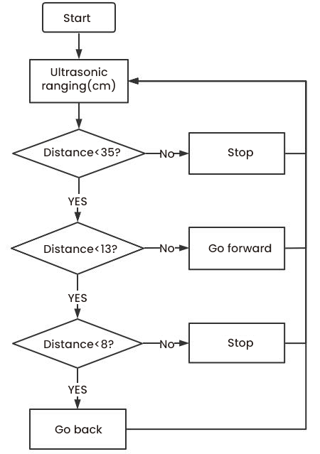

Test Code：

/*
Project 07.2: follow me
Car follows the object
*/ 
const int left_ctrl = 4;//define direction control pins of the left motor as D4
const int left_pwm = 6;//define speed control pins of the left motor as D6
const int right_ctrl = 2;//define the direction control pin of the right motor D2
const int right_pwm = 5;//define the speed control pin of the right motor D5
#include "SR04.h" //define the ultrasonic module function library
#define TRIG_PIN 8// define signals input of the ultrasonic asD8
#define ECHO_PIN 7//define the signal output of the ultrasonic sensor as D7
SR04 sr04 = SR04(ECHO_PIN,TRIG_PIN);
long distance;
const int servopin = 9;//define the pin of the servo asD9
int myangle;
int pulsewidth;

void setup() {
  pinMode(left_ctrl,OUTPUT);//Set the direction control pin of the left motor to OUTPUT
  pinMode(left_pwm,OUTPUT);//Set the PWM control speed of the left motor to OUTPUT
  pinMode(right_ctrl,OUTPUT);//Set the direction control pin of the right motor to OUTPUT
  pinMode(right_pwm,OUTPUT);//Set the PWM control speed of the right motor to OUTPUT
  pinMode(TRIG_PIN,OUTPUT);//Set TRIG_PIN to OUTPUT
  pinMode(ECHO_PIN,INPUT);//Set ECHO_PIN to INPUT
  servopulse(servopin,90);//set the initial angle to 90
  delay(300);
}

void loop() {
  distance = sr04.Distance();//the distance detected by the ultrasonic sensor
  if(distance<8)//if the distance is less than 8
  {
    back();//go back
  }
  else if((distance>=8)&&(distance<13))//if 8≤distance<13
  {
    Stop();//stop
  }
  else if((distance>=13)&&(distance<35))//if 13≤distance<35
  {
    front();//follow
  }
  else//if above conditions are not met
  {
    Stop();//stop
  }
}

void servopulse(int servopin,int myangle)//angles the servo rotate
{
  for(int i=0; i<20; i++)
  {
    pulsewidth = (myangle*11)+500;
    digitalWrite(servopin,HIGH);
    delayMicroseconds(pulsewidth);
    digitalWrite(servopin,LOW);
    delay(20-pulsewidth/1000);
  }  
}

void front()//define the state of going forward
{
  digitalWrite(left_ctrl,LOW); //Set direction control pins of the left motor to LOW
  analogWrite(left_pwm,200); //Set the PWM control speed of the left motor to 200
  digitalWrite(right_ctrl,LOW); //set control pins of the right motor to LOW
  analogWrite(right_pwm,200); //Set the PWM control speed of the right motor to 200
}
void back()//define the state of going back
{
  digitalWrite(left_ctrl,HIGH); //set control pins of the left motor to HIGH
  analogWrite(left_pwm,50); //Set the PWM control speed of the left motor to 50
  digitalWrite(right_ctrl,HIGH); //Set direction control pins of the right motor to HIGH
  analogWrite(right_pwm,50); //Set the PWM control speed of the right motor to 50
}
void Stop()//define the state of stop
{
  digitalWrite(left_ctrl,LOW);//Set direction control pins of the left motor to LOW
  analogWrite(left_pwm,0);//set the PWM control speed of the left motor to 0
  digitalWrite(right_ctrl,LOW);//set control pins of the right motor to LOW
  analogWrite(right_pwm,0);//set the PWM control speed of the right motor to 0
}

5.Test Result：

Upload the code to the Arduino Nano board, install batteries and turn the switch
to the ON end and power up. Then the car will follow the obstacle to move.

#### Project 7.3: Dodge obstacles

1.Description：

In this project, we will take advantage of the ultrasonic sensor to detect the
distance away from the obstacle so as to avoid them

2\. Working Principle：

|      | 8\*8 Dot matrix display                                |                                                         |                                                 |
|------|--------------------------------------------------------|---------------------------------------------------------|-------------------------------------------------|
|      | Set servo to 90°                                       |                                                         |                                                 |
| loop | Detect the distance away from the obstacle（unit: cm） |                                                         |                                                 |
|      | Condition 1                                            | State                                                   |                                                 |
|      |  0\<distance＜10                                       | Stop                                                    |                                                 |
|      |                                                        | Show the“stop”pattern                                   |                                                 |
|      |                                                        | Set the servo to 180°                                   | Distance away form the obstacle：a1（unit：cm） |
|      |                                                        | Set the servo to 0°                                     | Distance away form the obstacle：a2（unit：cm） |
|      |                                                        | Condition 2                                             | State                                           |
|      |                                                        | a1＜a2                                                  | Car turns right（set PWM to 200）               |
|      |                                                        |                                                         | show“turning right”pattern                      |
|      |                                                        |                                                         | Set servo to 90°                                |
|      |                                                        | a1≥a2                                                   | Turn left（set PWM to 200）                     |
|      |                                                        |                                                         | display“left turning”pattern                    |
|      |                                                        |                                                         | Set servo to 90°                                |
|      | distance≥10                                            | The 8\*8 dot matrix display shows“going forward”pattern |                                                 |
|      |                                                        | Go forward（set PWM to 200）                            |                                                 |

3\. Flow Chart：

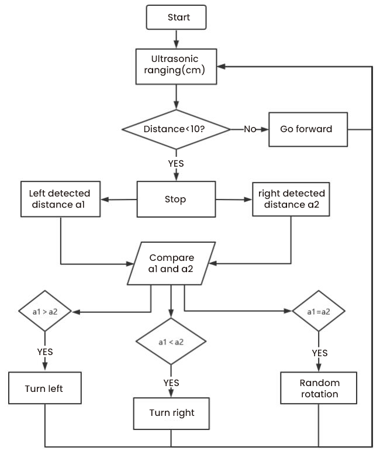

Test Code：

/*
Project 07.3: avoid obstacles
*/  
#include <ks_Matrix.h>
Matrix myMatrix(A4,A5);// define pins of the dot matrix display as A4 and A5
//Array, used to store pattern data, which can be calculated by yourself or obtained from the touch tool
uint8_t matrix_front[8]={0x18,0x24,0x42,0x99,0x24,0x42,0x81,0x00};
uint8_t matrix_back[8]={0x00,0x81,0x42,0x24,0x99,0x42,0x24,0x18};
uint8_t matrix_left[8]={0x12,0x24,0x48,0x90,0x90,0x48,0x24,0x12};
uint8_t matrix_right[8]={0x48,0x24,0x12,0x09,0x09,0x12,0x24,0x48};
uint8_t matrix_stop[8]={0x18,0x18,0x18,0x18,0x18,0x00,0x18,0x18};
uint8_t  LEDArray[8];
const int left_ctrl = 4;//define the direction control pin of the left motor to D4
const int left_pwm = 6;//define the speed control pin of the left motor D6
const int right_ctrl = 2;//define the direction control pin of the right motor D2
const int right_pwm = 5;//define the speed control pin of the right motor D5
#include "SR04.h"//define the ultrasonic module function library
#define TRIG_PIN 8// define signals input of the ultrasonic as D8
#define ECHO_PIN 7//define the signal pin of the ultrasonic sensor as D7
SR04 sr04 = SR04(ECHO_PIN,TRIG_PIN);
long distance,a1,a2;//define three distance variables
const int servopin = 9;//define the pin of the servo as D9
int myangle;
int pulsewidth;
int val;

void setup() {
  pinMode(left_ctrl,OUTPUT);//Set the direction control pin of the left motor to OUTPUT
  pinMode(left_pwm,OUTPUT);//Set the PWM control speed of the left motor to OUTPUT
  pinMode(right_ctrl,OUTPUT);//Set the direction control pin of the right motor to OUTPUT
  pinMode(right_pwm,OUTPUT);//Set the PWM control speed of the right motor to OUTPUT
  pinMode(TRIG_PIN,OUTPUT);//Set TRIG_PIN to OUTPUT
  pinMode(ECHO_PIN,INPUT);//Set ECHO_PIN to INPUT
  servopulse(servopin,90);//set the initial angle of the servo to 90
  delay(300);
  myMatrix.begin(112);
  myMatrix.clear();
}
 
void loop()
 {
  avoid();//run the code of obstacle avoidance
}

void avoid()
{
  distance=sr04.Distance(); //obtain the value detected by the ultrasonic sensor
  if((distance < 10)&&(distance != 0))// if 0<distance <10
  {
    car_Stop();//stop
    myMatrix.clear();
    myMatrix.writeDisplay();// show stop pattern
    matrix_display(matrix_stop);  //show the pattern to stop
    delay(100);
    servopulse(servopin,180);//servo rotates to 180°
    delay(200);
    a1=sr04.Distance();//measure distance
    delay(100);
    servopulse(servopin,0);//rotate to 0°
    delay(200);
    a2=sr04.Distance();//measure distance
    delay(100);
    if(a1 > a2)//compare distance, the left one is longer than the right
    {
      car_left();//turn left
      myMatrix.clear();
      myMatrix.writeDisplay();
      matrix_display(matrix_left);    //show the pattern to turn left
      servopulse(servopin,90);//rotate to 90°
      //delay(50);
      myMatrix.clear();
      myMatrix.writeDisplay();
      matrix_display(matrix_front);   //show the pattern to go front
    }
    else//if the right distance is longer than the left distance
    {
      car_right();//turn right
      myMatrix.clear();
      myMatrix.writeDisplay();
      matrix_display(matrix_right);   //show the patter to turn right
      servopulse(servopin,90);//the servo rotate to 90°
      //delay(50);
      myMatrix.clear();
      myMatrix.writeDisplay();
      matrix_display(matrix_front);  //show the pattern to go front
    }
  }
  else//if above conditions are not met
  {
    car_front();//go front
    myMatrix.clear();
    myMatrix.writeDisplay();
    matrix_display(matrix_front);  //show the pattern to go front
  }
}

void servopulse(int servopin,int myangle)//
{
  for(int i=0; i<20; i++)
  {
    pulsewidth = (myangle*11)+500;
    digitalWrite(servopin,HIGH);
    delayMicroseconds(pulsewidth);
    digitalWrite(servopin,LOW);
    delay(20-pulsewidth/1000);
  } 
}

void car_front()//define the state of going front
{
  digitalWrite(left_ctrl,LOW); //Set direction control pins of the left motor to LOW
  analogWrite(left_pwm,200); //Set the PWM control speed of the left motor to 200
  digitalWrite(right_ctrl,LOW); //set control pins of the right motor to LOW
  analogWrite(right_pwm,200); //Set the PWM control speed of the right motor to 200
}
void car_back()//define the state of going back
{
  digitalWrite(left_ctrl,HIGH); //set control pins of the left motor to HIGH
  analogWrite(left_pwm,50); //Set the PWM control speed of the left motor to 50
  digitalWrite(right_ctrl,HIGH); //Set direction control pins of the right motor to HIGH
  analogWrite(right_pwm,50); //Set the PWM control speed of the right motor to 50
}
void car_left()//define the state of turning left
{
  digitalWrite(left_ctrl,HIGH); //set control pins of the left motor to HIGH
  analogWrite(left_pwm,200); //Set the PWM control speed of the left motor to 200
  digitalWrite(right_ctrl,LOW); //Set control pins of the right motor to LOW
  analogWrite(right_pwm,200); //Set the PWM control speed of the right motor to 200
}
void car_right()//define the state of turning left
{
  digitalWrite(left_ctrl,LOW); //Set direction control pins of the left motor to LOW
  analogWrite(left_pwm,200); //Set the PWM control speed of the left motor to 200
  digitalWrite(right_ctrl,HIGH); //Set direction control pins of the right motor to HIGH
  analogWrite(right_pwm,200); //Set the PWM control speed of the right motor to 200
}
void car_Stop()//define the state of stopping
{
  digitalWrite(left_ctrl,LOW);//Set direction control pins of the left motor to LOW
  analogWrite(left_pwm,0);//Set the PWM control speed of the left motor to 0
  digitalWrite(right_ctrl,LOW);//set control pins of the right motor to LOW
  analogWrite(right_pwm,0);//Set the PWM control speed of the right motor to 0
}

//show functions of patterns
void matrix_display(unsigned char matrix_value[])
{
  for(int i=0; i<8; i++)
    {
      LEDArray[i]=matrix_value[i];
      for(int j=7; j>=0; j--)
      {
        if((LEDArray[i]&0x01)>0)
        myMatrix.drawPixel(j, i,1);
        LEDArray[i] = LEDArray[i]>>1;
      }
    } 
    myMatrix.writeDisplay();
}                            

Test Result：

Upload the test code to the Arduino Nano board, put batteries in the battery
holder, turn the power switch to the ON end and power up. Then the car can
automatically dodge obstacles

### Project 8: Line Tracking Sensor

There are two IR line tracking sensors on the car. They are actually two pairs
of ST188L3 infrared tubes and used to detect black and white lines. In this
project, we will make a line tracking car.

#### Project 8.1: Reading Values

1.Description：

In this experiment, we use ST188L3 infrared tubes to detect black and white
lines, then print the data on the serial monitor.

2\. Knowledge：

Infrared line tracking:

The IR line tracking sensor boasts a pair of ST188L3 infrared tubes. ST188L3
tubes has an infrared emitting diode and a receiver tube. When the emitting
diode emits an infrared signal then received by the receiving tube after being
reflected by the white object. Once the receiving tube receives the signal, the
output terminal will output a low level (0); when the infrared emitting diode
emits an infrared signal, and the infrared signal is absorbed by the black
object, a high level (1) will be output, thus realizing the function of
detecting signals through infrared rays.

Warning: Reflective optical sensors (including IR line tracking sensors)
shouldn’t be applied under sunlight as there is a lot of invisible light such as
infrared and ultraviolet.

Values detected by the line tracking sensor are shown in the table.

The value will be 1 if detecting black or no objects and the value 0 will appear
if detecting white objects.

he detected black object or no object represents 1, and the detected white
object represents 0.

| Left | Right | Value（Binary ） |
|------|-------|------------------|
| 0    | 0     | 00               |
| 0    | 1     | 01               |
| 1    | 0     | 10               |
| 1    | 1     | 11               |

3\. Test Code：

The line tracking sensors of the PCB board are controlled by D11 and D10 of the
Arduino Nano baord.

/*
Project 08.1: Tracking sensor read value
*/ 
int tracking_left = 11; //define the pin of the left sensor as D11
int tracking_right = 10; //define the pin of the right sensor as D10
int L_val,R_val; //define two variables of two sensors

void setup() {
 Serial.begin(9600); //set baud rate to 9600
 pinMode(tracking_left, INPUT); //set pins of the left sensor to OUTPUT
 pinMode(tracking_right, INPUT); //set pins of the right sensor to INPUT
}

void loop() {
 L_val = digitalRead(tracking_left); //read the value of the left sensor
 R_val = digitalRead(tracking_right); //read the value of the right sensor
 Serial.print("L_val: "); //serial print L_val
 Serial.print(L_val); //serial prints L_val
 Serial.print("    "); //serial prints space key
 Serial.print("R_val: "); //serial prints R_val
 Serial.println(R_val); //serial prints the R_val
 delay(300); //delay in 0.3s
}

4.Test Result：

Upload the test code to the Arduino Nano board, power up with a USB cable, open
the serial monitor and set baud rate to 9600.

Put a black thing under the line tracking sensor of the car and move it, you
will see different indicators light up, and at the same time you will see the
value on the serial monitor.

The sensitivity can be adjusted by rotating the potentiometer. When the
indicator light is adjusted to the critical point of on and off state, the
sensitivity is the highest.

#### Project 8.2: Line Tracking

1.Description：

We’ve introduced the knowledge of motor drivers, speed regulation, and infrared
line tracking. In this experiment, the car will perform different actions
according to the values transmitted by the infrared tracking.

Working Principle：

| Left | Right | Value（Binary ） | State        |
|------|-------|------------------|--------------|
| 0    | 0     | 00               | Stop         |
| 0    | 1     | 01               | Turn right   |
| 1    | 0     | 10               | Turn left    |
| 1    | 1     | 11               | Move forward |

Flow Chart：

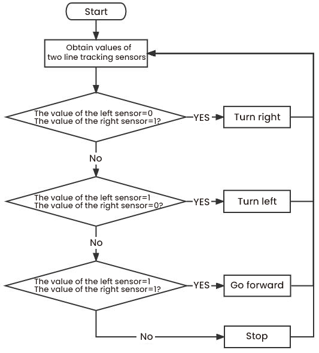

Test Code：

/*
Project 08.2: Follow line to walk
*/
const int left_ctrl = 4;//define direction control pins of the left motor as D4
const int left_pwm = 6;//define speed control pins of the left motor as D5
const int right_ctrl = 2;//define the direction control pin of the right motor D2
const int right_pwm = 5;//define the speed control pin of the right motor D5
int tracking_left = 11;//define the pin of the left sensor as D11
int tracking_right = 10;//define the pin of the right sensor as D10
int L_val,R_val;//define two variables of two line tracking sensors
const int servopin = 9;//define the pin of the servo asD9
int myangle;
int pulsewidth;

void setup() {
  pinMode(left_ctrl,OUTPUT);//Set the direction control pin of the left motor to OUTPUT
  pinMode(left_pwm,OUTPUT);//Set the PWM control speed of the left motor to OUTPUT
  pinMode(right_ctrl,OUTPUT);//Set the direction control pin of the right motor to OUTPUT
  pinMode(right_pwm,OUTPUT);//Set the PWM control speed of the right motor to OUTPUT
  pinMode(tracking_left, INPUT); //set the pin of the left sensor to INPUT
  pinMode(tracking_right, INPUT); //set the pin of the right sensor to INPUT
  servopulse(servopin,90);//set the initial angle of the servo to 90
  delay(300);
}

void loop() 
{
  tracking(); //run the main program
}

void tracking()
{
  L_val = digitalRead(tracking_left);//Read the value of the left sensor
  R_val = digitalRead(tracking_right);//Read the value of the right sensor
  if((L_val == 1)&&(R_val == 1))//if sensors detect black lines
  {
    front();//go forward
  }
  else if((L_val == 1)&&(R_val == 0))//if only the left sensor detects black lines
  {
    left();//turn left
  }
  else if((L_val == 0)&&(R_val == 1))//if only the right one detects the black line
  {
    right();//turn right
  }
  else//if none of sensors detects black lines
  {
    Stop();//stop
   }
}

void servopulse(int servopin,int myangle)//angles the servo run
{
  for(int i=0; i<20; i++)
  {
    pulsewidth = (myangle*11)+500;
    digitalWrite(servopin,HIGH);
    delayMicroseconds(pulsewidth);
    digitalWrite(servopin,LOW);
    delay(20-pulsewidth/1000);
  }  
}

void front()//define the state of going front
{
  digitalWrite(left_ctrl,LOW); //Set direction control pins of the left motor to LOW
  analogWrite(left_pwm,200); //Set the PWM control speed of the left motor to 200
  digitalWrite(right_ctrl,LOW); //set control pins of the right motor to LOW
  analogWrite(right_pwm,200); //Set the PWM control speed of the right motor to 200
}
void left()//define the state of turning left
{
  digitalWrite(left_ctrl,HIGH); //set control pins of the left motor to HIGH
  analogWrite(left_pwm,200); //Set the PWM control speed of the left motor to 200
  digitalWrite(right_ctrl,LOW); //set control pins of the right motor to LOW
  analogWrite(right_pwm,200); //Set the PWM control speed of the right motor to 200
}
void right()//define the state of turning left
{
  digitalWrite(left_ctrl,LOW); //Set direction control pins of the left motor to LOW
  analogWrite(left_pwm,200); //Set the PWM control speed of the left motor to 200
  digitalWrite(right_ctrl,HIGH); //Set direction control pins of the right motor to HIGH
  analogWrite(right_pwm,200); //Set the PWM control speed of the right motor to 200
}
void Stop()//define the state of stopping
{
  digitalWrite(left_ctrl,LOW);//Set direction control pins of the left motor to LOW
  analogWrite(left_pwm,0);//Set the PWM control speed of the left motor to 0
  digitalWrite(right_ctrl,LOW);//set control pins of the right motor to LOW
  analogWrite(right_pwm,0);//Set the PWM control speed of the right motor to 0
}

Test Result：

Upload the test code to the Arduino Nano board, turn the power switch to the ON
end, power up and put the car on a map we provide. Then it will perform
different functions via values sent by line tracking sensors

### Project 9: Light Following

There are two photoresistors on the car. They can vary with the light intensity
and send information to the Nano board to control the car.

Photoresistors can determine and conduct the car to move by detecting light

#### Project 9.1 Read Values

Description：

In this experiment, we will learn the working principle of the photoresistor

2\. Knowledge：

Photoresistor:

It mainly uses a photosensitive resistance element whose resistance varies from
the light intensity. The signal terminal of the sensor is connected to the
analog port of the microcontroller. When the light is stronger, the analog value
at the analog port will increase; on the contrary, when the light intensity is
weaker, the analog value of the microcontroller will reduce. In this way, the
corresponding analog value can reflect the ambient light intensity.

3\. Wire up：

Through the wiring-up diagram, signal pins of two photoresistors are connected
to A6 and A7 of the Nano board.

For the following experiment, we use the photoresistor connected to A6 to finish
experiments. First, let’s read analog values.

| Left photoresistor | PCB board |
|--------------------|-----------|
| G                  | G         |
| V                  | V         |
| S                  | S（A6）   |

4\. Test Code：

The left photoresistor is controlled by the A6 of the Arduino Nano board.

/*
Project 09.1:Read Photosensor Value
*/
int sensorPin = A6;    // select the input pin for the photocell
int sensorValue = 0;  // variable to store the value coming from the sensor
void setup() {
Serial.begin(9600);
}
void loop() {
sensorValue = analogRead(sensorPin);  // read the value from the sensor:
Serial.println(sensorValue);  //Serial port prints the value of photoresistor
delay(500);
}

5\. Test Result：

Upload the test code to the Arduino Nano board, power up with a USB cable, open
the serial monitor and set baud to 9600.

When the light intensifies, the analog value will get increased; on the
contrary, the analog value will get reduced.

Project 9.2: Light Following Car

Description：

We have learned the working principle of photoresistor, motor and speed
regulation. In this experiment, we will use a photoresistor to detect the
intensity of light as as to achieve the light following effect.

Working Principle：

| Analog value of the left sensor | Analog value of the right sensor | Function      |
|---------------------------------|----------------------------------|---------------|
| \>500                           | \>500                            | Move forward  |
| \>500                           | ≤500                             | Move to left  |
| ≤500                            | \>500                            | Move to right |
| \<500                           | \<500                            | Stop          |

Wiring up：

| Left Photoresistor | PCB Board |   | Right photoresistor | PCB Board |
|--------------------|-----------|---|---------------------|-----------|
| G                  | G         |   | G                   | G         |
| V                  | V         |   | V                   | V         |
| S                  | S（A6）   |   | S                   | S（A7）   |

Flow Chart：

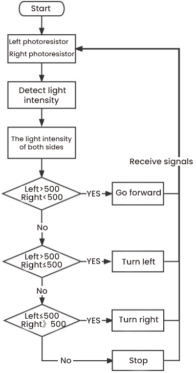

Test Code：

Left and right photoresistors are controlled by A6 and A7 of the Arduino Nano
board.

/*
Project 09.2:Light Following Car
*/ 
const int light_L_Pin = A6;   //define the pins of the left photoresistor to A6
const int light_R_Pin = A7;   //define the pins of the right photoresistor to A7
const int left_ctrl = 4;//define direction control pins of the left motor as D4 
const int left_pwm = 6;//define speed control pins of the left motor as D6 
const int right_ctrl = 2;//define the direction control pin of the right motor D2
const int right_pwm = 5;//define the speed control pin of the right motor D5
int left_light; 
int right_light;
const int servopin = 9;//define the pin of the servo asD9
int myangle;
int pulsewidth;

void setup(){
  Serial.begin(9600);
  pinMode(light_L_Pin, INPUT); //Set pins of the left photoresistor to INPUT
  pinMode(light_R_Pin, INPUT); //Set pins of the right photoresistor to INPUT
  pinMode(left_ctrl,OUTPUT);//Set the direction control pin of the left motor to OUTPUT
  pinMode(left_pwm,OUTPUT);//Set the PWM control speed of the left motor to OUTPUT
  pinMode(right_ctrl,OUTPUT);//Set the direction control pin of the right motor to OUTPUT
  pinMode(right_pwm,OUTPUT);//Set the PWM control speed of the right motor to OUTPUT
  servopulse(servopin,90);//set the initial angle of the servo to 90
  delay(300);
}

void loop(){
  left_light = analogRead(light_L_Pin);//read the value of the left photoresistor
  right_light = analogRead(light_R_Pin);//read the value of the right photoresistor
  Serial.print("left_light_value = ");
  Serial.println(left_light);
  Serial.print("right_light_value = ");
  Serial.println(right_light);
  if (left_light > 500 && right_light > 500) //range photoresistors can detect
  {  
    Car_front(); //go forward
  } 
  else if (left_light >500 && right_light <= 500)  //range photoresistors can detect
  {
    Car_left(); //turn left
  } 
  else if (left_light <= 500 && right_light > 500) //range photoresistors can detect
  {
    Car_right(); //turn right
  } 
  else  //if above conditions are not met
  {
    Car_Stop(); //stop
  }
}

void servopulse(int servopin,int myangle)//angles the servo run
{
  for(int i=0; i<20; i++)
  {
    pulsewidth = (myangle*11)+500;
    digitalWrite(servopin,HIGH);
    delayMicroseconds(pulsewidth);
    digitalWrite(servopin,LOW);
    delay(20-pulsewidth/1000);
  }  
}

void Car_front()
{
  digitalWrite(left_ctrl,LOW); //Set direction control pins of the left motor to LOW
  analogWrite(left_pwm,200); //Set the PWM control speed of the left motor to 200
  digitalWrite(right_ctrl,LOW); //set control pins of the right motor to LOW
  analogWrite(right_pwm,200); //Set the PWM control speed of the right motor to 200
}
void Car_left()
{
  digitalWrite(left_ctrl,HIGH); //set control pins of the left motor to HIGH
  analogWrite(left_pwm,200); //Set the PWM control speed of the left motor to 200
  digitalWrite(right_ctrl,LOW); //set control pins of the right motor to LOW
  analogWrite(right_pwm,200); //Set the PWM control speed of the right motor to 200;
}
void Car_right()
{
  digitalWrite(left_ctrl,LOW); //Set direction control pins of the left motor to LOW
  analogWrite(left_pwm,200); //Set the PWM control speed of the left motor to 200
  digitalWrite(right_ctrl,HIGH); //Set direction control pins of the right motor to HIGH
  analogWrite(right_pwm,200); //Set the PWM control speed of the right motor to 200
}
void Car_Stop()
{
  digitalWrite(left_ctrl,LOW);//Set direction control pins of the left motor to LOW
  analogWrite(left_pwm,0);//Set the PWM control speed of the left motor to 0
  digitalWrite(right_ctrl,LOW);//set control pins of the right motor to LOW
  analogWrite(right_pwm,0);//Set the PWM control speed of the right motor to 0
}

6\. Test Result：

Upload the test code to the Arduino Nano board, put batteries in the battery
holder, turn the power switch to the ON end and power up. Then the car will
follow the light to move.

### Project 10: IR Remote Control

Infrared remote controls are everywhere in daily life. It is used to control
various home appliances, such as TV, speakers, video recorders and satellite
signal receivers.

The remote control is composed of an IR emitter, an IR receiver and a decoding
MCU. In this project, we will make a IR remote control car.

#### Project 10.1: IR Remote and Reception

1.Description：

In this experiment, we will combine the IR receiver and the IR remote control to
read key values and show them on the serial monitor.

Knowledge：

IR Remote Control：

It is a device with buttons. When the key is pressed, IR signals will be sent.

Infrared remote control technology is widely used, such as TVs, air conditioners
and so on. And it can control air conditioners and TVs

The infrared remote control adopts NEC coding, and the signal period is 110ms.

The remote control is shown below:

Infrared (IR) receiver:

It can receive infrared light and be used to detect the infrared signal emitted
by the infrared remote control.

It can demodulate the received infrared light signal and convert it back to
binary, and then transmit the information to the microcontroller.

NEC Infrared communication protocol：

NEC Protocol

To my knowledge the protocol I describe here was developed by NEC (Now Renesas).
I've seen very similar protocol descriptions on the internet, and there the
protocol is called Japanese Format.

I do admit that I don't know exactly who developed it. What I do know is that it
was used in my late VCR produced by Sanyo and was marketed under the name of
Fisher. NEC manufactured the remote control IC.

This description was taken from my VCR's service manual. Those were the days,
when service manuals were filled with useful information!

Features

8 bit address and 8 bit command length.

Extended mode available, doubling the address size.

Address and command are transmitted twice for reliability.

Pulse distance modulation.

Carrier frequency of 38kHz.

Bit time of 1.125ms or 2.25ms.

Modulation

The NEC protocol uses pulse distance encoding of the bits. Each pulse is a 560µs
long 38kHz carrier burst (about 21 cycles). A logical "1" takes 2.25ms to
transmit, while a logical "0" is only half of that, being 1.125ms. The
recommended carrier duty-cycle is 1/4 or 1/3

Protocol

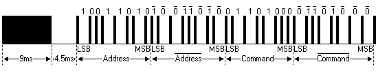

The picture above shows a typical pulse train of the NEC protocol. With this
protocol the LSB is transmitted first. In this case Address \$59 and Command
\$16 is transmitted. A message is started by a 9ms AGC burst, which was used to
set the gain of the earlier IR receivers. This AGC burst is then followed by a
4.5ms space, which is then followed by the Address and Command. Address and
Command are transmitted twice. The second time all bits are inverted and can be
used for verification of the received message. The total transmission time is
constant because every bit is repeated with its inverted length. If you're not
interested in this reliability you can ignore the inverted values, or you can
expand the Address and Command to 16 bits each!

Keep in mind that one extra 560µs burst has to follow at the end of the message
in order to be able to determine the value of the last bit.

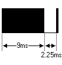

A command is transmitted only once, even when the key on the remote control
remains pressed. Every 110ms a repeat code is transmitted for as long as the key
remains down. This repeat code is simply a 9ms AGC pulse followed by a 2.25ms
space and a 560µs burst.

Extended NEC protocol

The NEC protocol is so widely used that soon all possible addresses were used
up. By sacrificing the address redundancy the address range was extended from
256 possible values to approximately 65000 different values. This way the
address range was extended from 8 bits to 16 bits without changing any other
property of the protocol.

By extending the address range this way the total message time is no longer
constant. It now depends on the total number of 1's and 0's in the message. If
you want to keep the total message time constant you'll have to make sure the
number 1's in the address field is 8 (it automatically means that the number of
0's is also 8). This will reduce the maximum number of different addresses to
just about 13000.

The command redundancy is still preserved. Therefore each address can still
handle 256 different commands.

Keep in mind that 256 address values of the extended protocol are invalid
because they are in fact normal NEC protocol addresses. Whenever the low byte is
the exact inverse of the high byte it is not a valid extended address.

3.Test Code：

The IR receiver on the PCB board is controlled by IO port(D12) of the Arduino
Nano board.

/*
Project 10.1:Infrared remote and receiver
*/
#include <IRremote.h>
int RECV_PIN = 12;
IRrecv irrecv(RECV_PIN);
decode_results results;
void setup()
{
  Serial.begin(9600);
  irrecv.enableIRIn(); // start receiving signals
}
void loop() {
  if (irrecv.decode(&results)) {
    Serial.println(results.value, HEX);
    irrecv.resume(); // receive the next value
  }
  delay(100);
}

5.Test Result：

Upload the test code to the Arduino Nano board, power up with a USB cable, open
the serial monitor and set to 9600

Press a key on the IR remote control, you will view a code on the serial
monitor. If FFFFFFFF shows up, just ignore it

Code of each key

Project 10.2: IR Remote Control Car

1.Description：

In the above experiment, we have learned about the knowledge of the 8\*8 dot
matrix display, the motor driver and speed regulation, the infrared receiver and
the infrared remote control. In this experiment, we will use the infrared remote
control and the infrared receiver to control the car.

Working Principle：

| Keys                                             | Keys Code | Functions                  |
|--------------------------------------------------|-----------|----------------------------|
|   | FF629D    | Go forward                 |
|                                                  |           | Display “forward”pattern   |
|   | FFA857    | Go back                    |
|                                                  |           | Display “back”pattern      |
|   | FF22DD    | Turn left                  |
|                                                  |           | Show“left” pattern         |
|   | FFC23D    | Turn right                 |
|                                                  |           | Show“right turning”pattern |
|   | FF02FD    | stop                       |
|                                                  |           | show“stop”pattern          |

Flow Chart：

/*
Project 10.2:Infrared remote control car
*/ 
#include <ks_Matrix.h>
Matrix myMatrix(A4,A5);//define pins of the dot matrix display as A4, and A5
//Array, used to store pattern data, which can be calculated by yourself or obtained from the touch tool
uint8_t matrix_front[8]={0x18,0x24,0x42,0x99,0x24,0x42,0x81,0x00};
uint8_t matrix_back[8]={0x00,0x81,0x42,0x24,0x99,0x42,0x24,0x18};
uint8_t matrix_left[8]={0x12,0x24,0x48,0x90,0x90,0x48,0x24,0x12};
uint8_t matrix_right[8]={0x48,0x24,0x12,0x09,0x09,0x12,0x24,0x48};
uint8_t matrix_stop[8]={0x18,0x18,0x18,0x18,0x18,0x00,0x18,0x18};
uint8_t  LEDArray[8];
const int left_ctrl = 4;//define the control pin of the left motor as D4
const int left_pwm = 6;//define the control pin of the left motor as D6
const int right_ctrl = 2;//define the control pin of the right motor as D2
const int right_pwm = 5;//define the control pin of the right motor as D5
#include <IRremote.h>//IR remote function library
int RECV_PIN = 12;//define the pin of the IR reception as D12
IRrecv irrecv(RECV_PIN);
long irr_val;
decode_results results;
const int servopin = 9;//define the pin of the servo as D9
int myangle;
int pulsewidth;

void setup()
{
  Serial.begin(9600);//open serial port and set baud rate 9600
  pinMode(left_ctrl,OUTPUT);//set the direction control pin of the left motor to OUTPUT
  pinMode(left_pwm,OUTPUT);//set the pwm control pin of the left motor to OUTPUT
  pinMode(right_ctrl,OUTPUT);//set the control pin of the right motor to OUTPUT
  pinMode(right_pwm,OUTPUT);//set the pwm control pin of the right motor to OUTPUT
  pinMode(RECV_PIN,INPUT);//set the pin of the IR receiver to INPUT
  // In case the interrupt driver crashes on setup, give a clue
  // to the user what's going on.
  Serial.println("Enabling IRin");
  irrecv.enableIRIn(); // start receiving signals
  Serial.println("Enabled IRin");
  myMatrix.begin(112);
  myMatrix.clear();
  myMatrix.writeDisplay();
  servopulse(servopin,90);//set the initial angle of the servo to 90
  delay(300);
}

void loop()
 {
  if (irrecv.decode(&results)) 
 {
    irr_val = results.value;
    Serial.println(irr_val, HEX);//the serial prints the IR remote signals
    switch(irr_val)
    {
      case 0xFF629D : 
      car_front(); 
      myMatrix.clear();
      myMatrix.writeDisplay();
      matrix_display(matrix_front);  
      break;
      case 0xFFA857 : 
      car_back(); 
      myMatrix.clear();
      myMatrix.writeDisplay();
      matrix_display(matrix_back); 
      break;
      case 0xFF22DD : 
      car_left(); 
      myMatrix.clear();
      myMatrix.writeDisplay();
      matrix_display(matrix_left); 
      break; 
      case 0xFFC23D : 
      car_right();
      myMatrix.clear();
      myMatrix.writeDisplay();
      matrix_display(matrix_right); 
      break;
      case 0xFF02FD : 
      car_Stop();
      myMatrix.clear();
      myMatrix.writeDisplay();
      matrix_display(matrix_stop); 
      break;
    }
        irrecv.resume(); // receive the next value
  }
}

void servopulse(int servopin,int myangle)//the servo runs angles
{
  for(int i=0; i<20; i++)
  {
    pulsewidth = (myangle*11)+500;
    digitalWrite(servopin,HIGH);
    delayMicroseconds(pulsewidth);
    digitalWrite(servopin,LOW);
    delay(20-pulsewidth/1000);
  }  
}

void car_front()//define the state of going front
{
  digitalWrite(left_ctrl,LOW); //Set direction control pins of the left motor to LOW
  analogWrite(left_pwm,200); //Set the PWM control speed of the left motor to 200
  digitalWrite(right_ctrl,LOW); //set control pins of the right motor to LOW
  analogWrite(right_pwm,200); //Set the PWM control speed of the right motor to 200
}
void car_back()//define the state of going back
{
  digitalWrite(left_ctrl,HIGH); //set control pins of the left motor to HIGH
  analogWrite(left_pwm,50); //Set the PWM control speed of the left motor to 50
  digitalWrite(right_ctrl,HIGH); //Set direction control pins of the right motor to HIGH
  analogWrite(right_pwm,50); //Set the PWM control speed of the right motor to 50
}
void car_left()//define the state of turning left
{
  digitalWrite(left_ctrl,HIGH); //set control pins of the left motor to HIGH
  analogWrite(left_pwm,200); //Set the PWM control speed of the left motor to 200
  digitalWrite(right_ctrl,LOW); //set control pins of the right motor to LOW
  analogWrite(right_pwm,200); //Set the PWM control speed of the right motor to 200
}
void car_right()//define the state of turning right
{
  digitalWrite(left_ctrl,LOW); //Set direction control pins of the left motor to LOW
  analogWrite(left_pwm,200); //Set the PWM control speed of the left motor to 200
  digitalWrite(right_ctrl,HIGH); //Set direction control pins of the right motor to HIGH
  analogWrite(right_pwm,200); //set the PWM control speed of the right motor to 200
}
void car_Stop()//define the state of stop
{
  digitalWrite(left_ctrl,LOW);//Set direction control pins of the left motor to LOW
  analogWrite(left_pwm,0);//Set the PWM control speed of the left motor to 0
  digitalWrite(right_ctrl,LOW);//set control pins of the right motor to LOW
  analogWrite(right_pwm,0);//Set the PWM control speed of the right motor to 0
}

//
void matrix_display(unsigned char matrix_value[])
{
  for(int i=0; i<8; i++)
    {
      LEDArray[i]=matrix_value[i];
      for(int j=7; j>=0; j--)
      {
        if((LEDArray[i]&0x01)>0)
        myMatrix.drawPixel(j, i,1);
        LEDArray[i] = LEDArray[i]>>1;
      }
    } 
    myMatrix.writeDisplay();
}

Test Result：

Upload the test code to the Arduino Nano motherboard, install batteries, turn
the power switch to the ON end, power up and press a key of the IR remote
control. Then the car will make the corresponding movement.

### Project 11: WIFI Control

In this lesson, we control the car through app. The Beetlebot APP sends
commanders to the WIFI ESP-01 module then transfers to it to the
microcontroller. By doing this, the car can perform different functions.

#### Project 11.1: WIFI Test

1.Description：

The ESP8266 serial WiFi ESP-01 module is an ultra-low-power UART-WiFi
transparent transmission module and designed for mobile devices and IoT
applications.

It can achieve networking functions by connecting devices to Wifi internet

2\. Components Required

|  |  |
|-------------------------------------------------|-------------------------------------------------------------------------------------------------------------------|
| ESP8266 Serial WIFI ESP-01\*1                   | USB Serial ESP-01S WIFI Expansion Module\*1                                                                       |

3.Knowledge：

USB to ESP-01S WiFi module serial shield:

It is suitable for the ESP-01S WiFi module. Turn the DIP switch on the USB to
ESP-01S WiFi module serial Expansion Boardto Flash Boot, and plug into
computer’s USB port. You can use serial debugging tool to test the AT command.

Turn the DIP switch on the USB to ESP-01S WiFi module serial expansion board to
the UartDownload, ESP-01 module is at download mode. You can download the
firmware to ESP-01 module using AT firmware.

ESP8266 serial WiFi ESP-01 is an ultra-low-power UART-WiFi transparent
transmission module. It can be widely used in smart grids, intelligent
transportation, smart furniture, handheld devices, industrial control and other
fields.

Features

Support wireless 802.11 b/g/n standards

Support STA/AP/STA+AP three modes of operation

Built-in TCP/IP protocol stack to support multi-channel TCP Client connections

Supports many Socket AT commands

Supports UART / GPIO data communication interface

Supports Smart Link smart networking function

Supports remote firmware upgrades(OTA)

Built-in 32-bit MCU, can also be used as an application processor

Ultra-low-power and highly integrated Wi-Fi chip for battery-powered
applications

Working temperature range: -40 ° C to + 125 ° C

3.3V single power supply

Specification：

| Module                          | Type                   | ESP8266-01                                                                                                         |
|---------------------------------|------------------------|--------------------------------------------------------------------------------------------------------------------|
|                                 | Main chip              | ESP8266                                                                                                            |
| Wireless parameters             | Wireless standard      | IEEE 802.11b/g/n                                                                                                   |
|                                 | Frequency range        | 2.412GHz-2.484GHz                                                                                                  |
|                                 | Transmit power         | 802.11b: +16 +/-2dBm (@11Mbps)                                                                                     |
|                                 |                        | 802.11g: +14 +/-2dBm (@54Mbps)                                                                                     |
|                                 |                        | 802.11n: +13 +/-2dBm (@HT20, MCS7)                                                                                 |
|                                 | Receiving sensitivity  | 802.11b: -93 dBm (@11Mbps ,CCK)                                                                                    |
|                                 |                        | 802.11g: -85dBm (@54Mbps, OFDM)                                                                                    |
|                                 |                        | 802.11n: -82dBm (@HT20, MCS7)                                                                                      |
|                                 | Antenna type           | external stamp-hole interfaces                                                                                     |
|                                 |                        | external I-PEX connector and SMA connector                                                                         |
|                                 |                        | Built-in onboard PCB antenna                                                                                       |
| Hardware parameters             | Hardware interfaces    | UART，IIC，PWM，GPIO，ADC                                                                                          |
|                                 | Operating voltage      | 3.3V                                                                                                               |
|                                 | GPIO drive capability  | Max：15ma                                                                                                          |
|                                 | Working current        | Keep sending down=\> Average：\~70mA Peak: 200mA Normal mode=\> Average: \~12mA Peak: 200mA standby mode：\<200uA  |
|                                 | Operating temperature  | -40℃\~125℃                                                                                                         |
|                                 | Storage environment    | Temperature：\<40℃ Relative humidity：\<90%R.H                                                                     |
|                                 | Size                   | Onboard PCB antenna：14.3mm\*24.8mm\*1mm                                                                           |
| Serial transparent transmission | Transmission rate      | 110-921600bps                                                                                                      |
|                                 | TCP Client             | 5                                                                                                                  |
| Software Parameters             | Wireless network types | STA/AP/STA+AP                                                                                                      |
|                                 | Security mechanisms    | WEP/WPA-PSK/WPA2-PSK                                                                                               |
|                                 | Encryption types       | WEP64/WEP128/TKIP/AES                                                                                              |
|                                 | Firmware upgrade       | Local serial port, OTA remote upgrade                                                                              |
|                                 | Network protocols      | IPv4, TCP/UDP/FTP/HTTP                                                                                             |
|                                 | User configuration     | AT + instruction set, web page Android / iOS terminal, Smart Link intelligent configuration APP                    |

About the Hardware

ESP8266 has many hardware interfaces, supporting UART, IIC, PWM, GPIO, ADC,
etc., and suitable for a variety of IoT applications.

| PIN | Function         | Description                                                                                                                                                  |
|-----|------------------|--------------------------------------------------------------------------------------------------------------------------------------------------------------|
| 1   | URXD             | UART_RXD, receive General Purpose Input/Output：GPIO3                                                                                                        |
| 2   | UTXD             | UART_TXD, send 2）General Purpose Input/Ou tput: GPIO1 3）Do not pull down when power on                                                                     |
| 5   | RESET（GPIO 16） | External Reset signal, LOW reset, HIGH works(default is HIGH)                                                                                                |
| 6   | GND              | GND                                                                                                                                                          |
| 8   | VCC              | 3.3V, power the module                                                                                                                                       |
| 9   | ANT              | WiFi Antenna                                                                                                                                                 |
| 11  | GPIO0            | WiFi Status(Default)：WiFi status indicator control signal Working mode selection: Suspend：Flash Boot，working mode Pull down：UART Download，download mode |
| 12  | ADC              | ADC, input range: 0V-1V                                                                                                                                      |
| 13  | GPIO15           | Pull down：work mode                                                                                                                                         |
| 14  | CH_PD            | Working at HIGH level Power off at LOW level                                                                                                                 |
| 15  | GPIO2            | It must be HIGH level when power on, do not pull down the hardware Internal is pulled up(default)                                                            |

Power consumption

The below power consumption data is based on a 3.3V power supply and at
25°ambient temperature.

All measurements are completed at the antenna interface.

All transmitted data is based on 90% duty cycle, which is measured in a
continuous launch mode.

| Mode                                    | Min | Regular | Max | Unit |
|-----------------------------------------|-----|---------|-----|------|
| Send 802.11b，CCK 1Mbps，Pout=+19.5dBm  |     | 215     |     | mA   |
| Send 802.11b，CCK 11Mbps，Pout=+18.5dBm |     | 197     |     | mA   |
| Send 802.11g，OFDM54 Mbps，Pout=+16dBm  |     | 145     |     | mA   |
| Send 802.11n，MCS7，Pout=+14dBm         |     | 135     |     | mA   |
| Receive 802.11b, 1024 bytes, -80dBm     |     | 100     |     | mA   |
| Receive 802.11g, 1024 bytes, -70dBm     |     | 100     |     | mA   |
| Receive 802.11n, 1024 bytes, -65dBm     |     | 102     |     | mA   |
| Standby                                 |     | 70      |     | mA   |
| Shutdown                                |     | 0.5     |     | μA   |

Radio characteristic：

The following data were measured when the voltage is 3.3V at room temperature.

| Description                           | Min  | Regular | Max  | Unit |
|---------------------------------------|------|---------|------|------|
| input frequency                       | 2412 |         | 2484 | MHz  |
| input resistance                      |      | 50      |      | Ω    |
| input reflection                      |      |         | -10  | dB   |
| 72.2Mbps下，output power of PA        | 14   | 15      | 16   | dBm  |
| Under the 802.11b，output power of PA | 17.5 | 18.5    | 19.5 | dBm  |
| Sensitivity                           |      |         |      |      |
| CCK 1Mbps                             |      | -98     |      | dBm  |
| CCK 11Mbps                            |      | -91     |      | dBm  |
| 6Mbps(1/2BPSK)                        |      | -93     |      | dBm  |
| 54Mbps(3/4 64-QAM)                    |      | -75     |      | dBm  |
| HT20，MCS7（65Mbps，72.2Mbps）        |      | -71     |      | dBm  |
| Adjacent frequency suppression        |      |         |      |      |
| OFDM，6Mbps                           |      | 37      |      | dB   |
| OFDM，54Mbps                          |      | 21      |      | dB   |
| HT20，MCS0                            |      | 37      |      | dB   |
| HT20，MCS7                            |      | 20      |      | dB   |

| Description                                  | Min  | Type | Max  | Unit |
|----------------------------------------------|------|------|------|------|
| Input frequency                              | 2412 |      | 2484 | MHz  |
| Modes                                        | Min  | Typ  | Max  | Unit |
| Tx 802.11b, CCK 1Mbps, Pout=+19.5dBm         |      | 215  |      | mA   |
| Tx 802.11b, CCK 11Mbps, Pout=+18.5dBm        |      | 197  |      | mA   |
| Tx 802.11g, OFDM54 Mbps, Pout=+16dBm         |      | 145  |      | mA   |
| Tx 802.11n, MCS7, Pout=+14dBm                |      | 135  |      | mA   |
| Rx 802.11b, 1024 bytes packet length, -80dBm |      | 100  |      | mA   |
| Rx 802.11g, 1024 bytes packet length, -70dBm |      | 100  |      | mA   |
| Rx 802.11n, 1024 bytes packet length, -65dBm |      | 102  |      | mA   |
| Standby Mode                                 |      | 70   |      | mA   |
| Power Off                                    |      | 0.5  |      | μA   |

Input resistance

50

Ω

Input reflection

\-10

dB

PA output power at 72.2 Mbps

14

15

16

dBm

PA output power in 802.11b mode

17.5

18.5

19.5

dBm

Sensitivity

CCK 1Mbps

\-98

dBm

CCK 11Mbps

\-91

dBm

6Mbps(1/2BPSK)

\-93

dBm

54Mbps(3/4 64-QAM)

\-75

dBm

HT20，MCS7（65Mbps，72.2Mbps）

\-71

dBm

Adjacent channel rejection

OFDM，6Mbps

37

dB

OFDM，54Mbps

21

dB

HT20，MCS0

37

dB

HT20，MCS7

20

dB

Note:

1.72.2Mbps is measured in 802.11n mode；

Up to +19.5dBm output power in 802.11b mode.

Functions

A. Main functions

The main functions that can be achieved by ESP8266 include: serial port
transparent transmission , PWM regulation, GPIO control.

※Serial port transparent transmission: The transmission is reliable with a
maximum transmission rate of 460800bps.

※PWM regulation: Adjusting lights and tricolor LED, motor speed control, etc.

※GPIO control: Control switch, relay, etc.

Working modes

The ESP8266 module supports three operating modes, STA/AP/STA+AP.

❊STA mode: The ESP8266 module can access to the Internet through a router, so
the mobile phone or computer can remotely control the device through the
Internet.

❊AP mode: ESP8266 module, as a hotspot, allows the direct communication with the
module and cellphones/computers, achieving wireless control of the local area
network (LAN).

❊STA+AP mode: two modes coexist, that is, the Internet can achieve free switch

Applications

✭✮Serial CH340 to Wi-Fi

✭✮Industrial transparent transmission DTU

✭✮Wi-Fi remote monitoring/control

✭✮Toy industry

✭✮Color LED control

✭✮Integrated management of fire protection and security intelligence

✭✮Smart card terminals, wireless POS machines, Wi-Fi cameras, handheld devices,
etc

4\. Insert the Wifi serial port expansion board into the USB port of your PC

Insert the ESP8266 serial WIFI ESP-01 module into the USB to ESP-01S WIFI
expansion board.

Turn the DIP switch of the USB to ESP-01S WIF expansion board to UartDownload
end and plug it to the USB port of your computer

Set up the Esp8266 development environment

Insert the ESP8266 serial WiFi ESP-01 module into the USB to ESP-01S WiFi
expansion board correctly, and then plug the it into the USB port of the
computer. Click to enter the arduino-1.8.16 folder (you can also use the latest
version). Click to enter the
1.8.16 version of the IDE interface.

(1) Download and install from the Arduino IDE

A. Click File →Preferences, copy and paste this address
(<http://arduino.esp8266.com/stable/package_esp8266com_index.json>) in
the“Additional Boards Manager URLs:”, then click "OK" to save this address.

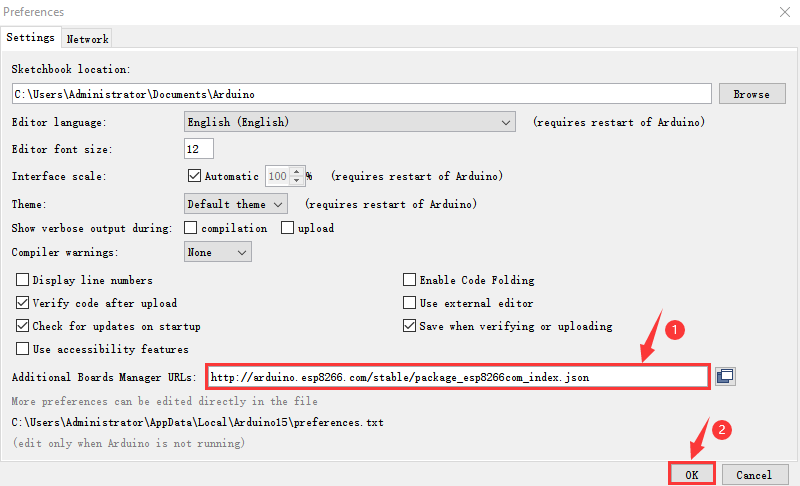

Click“Tools”→“Board:”, then click on "Board Manager..." to enter the "Board
Manager" page, type "ESP8266" behind "All". Then select the latest version to
install.

Click "Install" to start to install the relevant plug-ins.

(If downloading unsuccessfully, just click "Install" again)

However, due to network reasons, most users may not be able to search esp8266 by
esp8266 Community, so, we recommend you to install ESP8266 by tools.

Then click“Close”to close the page, and then click“Tools”→“Board:”, you can view
different models of ESP8266 development boards. Select the corresponding ESP8266
development board model and COM port to program ESP8266.

Install ESP8266 by tools (Recommended)

Click File \< Preferences, copy the link
<http://arduino.esp8266.com/stable/package_esp8266com_index.json> to “Additional
Boards Manager URLs:”box

Use“ESP8266 one-click installation of Arduino board version 2.5.0.exe”to install
ESP8266. This method is recommended.

Double-click“ESP8266 one-click installation of Arduino board version 2.5.0.exe”,
then the installation is finished.

After the above tool is installed, restart the Arduino IDE software and click on
the Arduino menu bar“Tools”→“Board” , you can view different models of ESP8266
development boards in it. Select the corresponding ESP8266 development board
model and COM port to program ESP8266.

6.Test Code：

Note: After opening the IDE, set the board type and COM port first. If you don't
have WiFi at home, you can turn your phone hotspot on to enable shared WiFi.

The UTXD pin of the WIFI ESP-01 module is controlled by the IO port RX (0) of
the Arduino Nano motherboard, and the URXD pin is controlled by the IO port TX
(1) of the Arduino Nano board.

/*
Project 10.1 WIFI test
*/
#include <ESP8266WiFi.h>
#include <ESP8266mDNS.h>
#include <WiFiClient.h>

#ifndef STASSID
//#define STASSID "your-ssid"
//#define STAPSK  "your-password"
#define STASSID "ChinaNet-2.4G-0DF0"   //the name of user's wifi
#define STAPSK  "ChinaNet@233"       //the password of user's wifi
#endif

const char* ssid = STASSID;
const char* password = STAPSK;

// TCP server at port 80 will response the HTTP requirement
WiFiServer server(80);

void setup(void) {
  Serial.begin(115200);

  //  connect WiFi 
  WiFi.mode(WIFI_STA);
  WiFi.begin(ssid, password);
  Serial.println("");

  // wait connection
  while (WiFi.status() != WL_CONNECTED) {
    delay(500);
    Serial.print(".");
  }
  Serial.println("");
  Serial.print("Connected to ");
  Serial.println(ssid);
  Serial.print("IP address: ");
  Serial.println(WiFi.localIP());

  // set the mDNS responder::
  // - in this example. the first parameter is domain name
  //   The fully qualified domain name is “esp8266.local”
  // - the second parameter is IP address
  //   send the IP address via WiFi
  if (!MDNS.begin("esp8266")) {
    Serial.println("Error setting up MDNS responder!");
    while (1) {
      delay(1000);
    }
  }
  Serial.println("mDNS responder started");

  // activate TCP (HTTP) server
  server.begin();
  Serial.println("TCP server started");

  // add the server to MDNS-SD
  MDNS.addService("http", "tcp", 80);
}

void loop(void) {

  MDNS.update();

  // check the client side is connected or not
  WiFiClient client = server.available();
  if (!client) {
    return;
  }
  Serial.println("");
  Serial.println("New client");

  // wait the effective data from the client side
  while (client.connected() && !client.available()) {
    delay(1);
  }

  // read the first row of HTTP requirement
  String req = client.readStringUntil('\r');

  // the first row of the HTTP requirement is shown below: "GET /path HTTP/1.1"
  // Retrieve the "/path" part by finding the spaces
  int addr_start = req.indexOf(' ');
  int addr_end = req.indexOf(' ', addr_start + 1);
  if (addr_start == -1 || addr_end == -1) {
    Serial.print("Invalid request: ");
    Serial.println(req);
    return;
  }
  req = req.substring(addr_start + 1, addr_end);
  Serial.print("Request: ");
  Serial.println(req);
  client.flush();

  String s;
  if (req == "/") {
    IPAddress ip = WiFi.localIP();
    String ipStr = String(ip[0]) + '.' + String(ip[1]) + '.' + String(ip[2]) + '.' + String(ip[3]);
    s = "HTTP/1.1 200 OK\r\nContent-Type: text/html\r\n\r\n<!DOCTYPE HTML>\r\n<html>Hello from ESP8266 at ";
    s += ipStr;
    s += "</html>\r\n\r\n";
    Serial.println("Sending 200");
  } else {
    s = "HTTP/1.1 404 Not Found\r\n\r\n";
    Serial.println("Sending 404");
  }
  client.print(s);

  Serial.println("Done with client");
}

7.Test Result：

Note: you need to change the account and password of Wifi in the code into
yours.

After the account and password of Wifi is changed, turn the DIP switch of the
USB to ESP-01S WIFI module to the Uart Download end and plug ESP-01S WIFI module
into the USB port of your PC.

Set board type and COM port.

And upload the ESP8266 code to the ESP8266 serial WIFI ESP-01 module

If the test code is not uploaded successfully, check the board type and the COM
port first, then unplug the ESP-01S WIFI module and restart it）

After the ESP8266 code is successfully uploaded, first unplug the USB to ESP-01S
WIFI module serial test expansion board from the computer, then turn its DIP
switch to Flash Boot and interface it with the USB port of your PC again. Open
the serial monitor ans set baud rate to 115200, as shown below;

#### Project 11.2 : Control 8\*8 Dot Matrix Display Via WIFI

1.Description：

In this experiment, we will use the ESP8266 serial WIFI ESP-01 module to control
the 8\*8 dot matrix display on the car through APP and WIFI.

2\. Insert the Wifi serial port expansion board into the USB port of your PC

Insert the ESP8266 serial WIFI ESP-01 module into the USB to ESP-01S WIFI
expansion board.

Turn the DIP switch of the USB to ESP-01S WIF expansion board to UartDownload
end and plug it to the USB port

3.ESP8266 Code：

The pin UTXD and URXD of the ESP8266 serial WIFI ESP-01 module are controlled by
RX(0) and TX(1) of the Arduino Nano board.

/*
Project 11.2_1 ESP8266_Code
*/
// generated by KidsBlock
#include <Arduino.h>
#include <ESP8266WiFi.h>
#include <ESP8266mDNS.h>
#include <WiFiClient.h>
//#include <WiFi.h>

#ifndef STASSID
#define STASSID "ChinaNet-2.4G-0DF0"
#define STAPSK  "ChinaNet@233"
#endif
const char* ssid = STASSID;
const char* password = STAPSK;

//IPAddress local_IP(192,168,4,22);
//IPAddress gateway(192,168,4,22);
//IPAddress subnet(255,255,255,0);
//
//const char *ssid = "ESP8266_AP_TEST";
//const char *password = "12345678";

WiFiServer server(80);
String unoData = "";
int ip_flag = 0;
int ultra_state = 1;
String ip_str;

void setup() {
  Serial.begin(9600); 
//   WiFi.mode(WIFI_AP); //set the APmode
//
//  WiFi.softAPConfig(local_IP, gateway, subnet); //set the AP address
//  while(!WiFi.softAP(ssid, password)){}; //enable AP
//  Serial.println("AP start successfully");
//
//  Serial.print("IP address: ");
//  Serial.println(WiFi.softAPIP()); // print the IP address
//
//  WiFi.softAPsetHostname("myHostName"); //print the host name
//  Serial.print("HostName: ");
//  Serial.println(WiFi.softAPgetHostname()); //print the host name
//
//  Serial.print("mac Address: ");
//  Serial.println(WiFi.softAPmacAddress()); //print the mac address

  WiFi.mode(WIFI_STA);
  WiFi.begin(ssid, password);
  while (WiFi.status() != WL_CONNECTED) {
    delay(500);
    Serial.print(".");
  }
  Serial.print("IP ADDRESS: ");
  Serial.println(WiFi.localIP());
  if (!MDNS.begin("esp8266")) {
    //Serial.println("Error setting up MDNS responder!");
    while (1) {
      delay(1000);
    }
  }
 // Serial.println("mDNS responder started");
  server.begin();
  //Serial.println("TCP server started");
  MDNS.addService("http", "tcp", 80);
  ip_flag = 1;
}

void loop() {
  //Serial.println(WiFi.softAPgetStationNum()); //
  if(ip_flag == 1)
  {
    for(int i=3; i>0; i--)
    {
      Serial.print("IP: ");
      Serial.print(WiFi.localIP());
      Serial.println('#');
      delay(500);
    }
    ip_flag = 0;
    
  }
    MDNS.update();
    WiFiClient client = server.available();
    if (!client) {
      return;
    }
    //Serial.println("");
    while (client.connected() && !client.available()) {
      delay(1);
    }
    String req = client.readStringUntil('\r');
    int addr_start = req.indexOf(' ');
    int addr_end = req.indexOf(' ', addr_start + 1);
    if (addr_start == -1 || addr_end == -1) {
      //Serial.print("Invalid request: ");
      //Serial.println(req);
      return;
    }
    req = req.substring(addr_start + 1, addr_end);
    int len_val = String(req).length();
    String M_req = String(req).substring(0,6);
    //Serial.println(M_req);
    if(M_req == "/btn/u")
    {
      String s_M_req = String(req).substring(5,len_val);
      Serial.print(s_M_req);
      Serial.print("#");
    }
    if(M_req == "/btn/v")
    {
      String s_M_req = String(req).substring(5,len_val);
      Serial.print(s_M_req);
      Serial.print("#");
    }
    client.flush();
    String s;
    if (req == "/") {
      IPAddress ip = WiFi.localIP();
      String ipStr = String(ip[0]) + '.' + String(ip[1]) + '.' + String(ip[2]) + '.' + String(ip[3]);
      s = "HTTP/1.1 200 OK\r\nContent-Type: text/html\r\n\r\n<!DOCTYPE HTML>\r\n<html>Hello from ESP8266 at ";
      s += ipStr;
      s += "</html>\r\n\r\n";
      //Serial.println("Sending 200");
      Serial.println(WiFi.localIP());
      Serial.write('*');
      client.println(WiFi.localIP());
      ip_flag = 0;
    }
    else if(req == "/btn/F")
    {
      Serial.write('F');
      client.println(F("F"));
    }
    else if(req == "/btn/B")
    {
      Serial.write('B');
      client.println(F("B"));
    }
    else if(req == "/btn/L")
    {
      Serial.write('L');
      client.println(F("L"));
    }
    else if(req == "/btn/R")
    {
      Serial.write('R');
      client.println(F("R"));
    }
    else if(req == "/btn/S")
    {
      Serial.write('S');
      client.println(F("S"));
    }
    else if(req == "/btn/a")
    {
      Serial.write('a');
      client.println(F("a"));
    }
    else if(req == "/btn/b")
    {
      Serial.write('b');
      client.println(F("b"));
    }
    else if(req == "/btn/c")
    {
      Serial.write('c');
      client.println(F("c"));
    }
    else if(req == "/btn/d")
    {
      Serial.write('d');
      client.println(F("d"));
    }
    else if(req == "/btn/e")
    {
      Serial.write('e');
      client.println(F("e"));
    }
    else if(req == "/btn/f")
    {
      Serial.write('f');
      client.println(F("f"));
    }
    else if(req == "/btn/g")
    {
      Serial.write('g');
      client.println(F("g"));
    }
    else if(req == "/btn/z")
    {
      Serial.write('z');
      client.println(F("z"));
    }
    else if(req == "/btn/i")
    {
      Serial.write('i');
      client.println(F("i"));
    }
    else if(req == "/btn/j")
    {
      Serial.write('j');
      client.println(F("j"));
    }
    else if(req == "/btn/k")
    {
      Serial.write('k');
      client.println(F("k"));
    }
    else if(req == "/btn/y")
    {
      Serial.write('y');
      client.println(F("y"));
    }
    else if(req == "/btn/l")
    {
      Serial.write('l');
      client.println(F("l"));
    }
    else if(req == "/btn/m")
    {
      Serial.write('m');
      client.println(F("m"));
    }
    else if(req == "/btn/n")
    {
      Serial.write('n');
      client.println("n");
    }
    else if(req == "/btn/o")
    {
      Serial.write('o');
      client.println(F("o"));
    }
    else if(req == "/btn/p")
    {
      Serial.write('p');
      client.println(F("p"));
    }
    else if(req == "/btn/q")
    {
      Serial.write('q');
      client.println("q");
    }
    else if(req == "/btn/x")
    {
      Serial.write('x');
      client.println(F("x"));
    }
    else if(req == "/btn/1")
    {
      Serial.write('1');
      client.println(F("1"));
    }
    else if(req == "/btn/2")
    {
      Serial.write('2');
      client.println("2");
    }
    else if(req == "/btn/3")
    {
      Serial.write('3');
      client.println(F("3"));
    }
    else if(req == "/btn/4")
    {
      Serial.write('4');
      client.println("4");
    }
    else if(req == "/btn/5")
    {
      Serial.write('5');
      client.println(F("5"));
    }
    else if(req == "/btn/0")
    {
      Serial.write('0');
      client.println("0");
    }
    else {
      //s = "HTTP/1.1 404 Not Found\r\n\r\n";
      //Serial.println("Sending 404");
    }

    client.print(F("IP : "));
    client.println(WiFi.localIP());
}

Note: you need to change the account and password of Wifi in the code into yours

After the account and password of Wifi is changed, turn the DIP switch of the
USB to ESP-01S WIFI module to the Uart Download end and plug ESP-01S WIFI module
into the USB port of your PC.

Set board type and COM port according to the Project 11 .1

And upload the ESP8266 code to the WIFI ESP-01 module

If the test code is not uploaded successfully, check the board type and the COM
port first, then unplug the ESP-01S WIFI module and restart it）

After the ESP8266 code is successfully uploaded, first unplug the USB to ESP-01S
WIFI module serial test expansion board from the computer, then disconnect the
ESP8266 serial WIFI ESP-01 module from the USB to ESP-01S WIFI expansion board

4\. Test Code：

Note: open the IDE and set the board type and the COM port. If there is no Wifi
in your home, just open your cellphone to start the shared Wifi via hotspot

    /*
    Project 11.2_2 WiFi control dot matrix
    */
    #include <ks_Matrix.h>
    Matrix myMatrix(A4,A5);//Define the dot matrix pins in A4,A5
    //Array, used to store the data of the pattern, can be calculated yourself 
    //or retrieved from the touch tool
    uint8_t matrix_smile[8]={0x00,0x66,0x00,0x00,0x18,0x42,0x3c,0x00};
    uint8_t matrix_heart[8]={0x0e,0x11,0x21,0x42,0x21,0x11,0x0e,0x00};
    uint8_t matrix_ten[8]={0x08,0x08,0x08,0x08,0xff,0x08,0x08,0x08};
    uint8_t LEDArray[8];
    char wifiData;

    void setup() {
    Serial.begin(9600);
    myMatrix.begin(112);
    myMatrix.clear();
    myMatrix.writeDisplay();
    }

    void loop() {
    if(Serial.available() > 0)
    {
        wifiData = Serial.read();
        Serial.print(wifiData);
        if(wifiData == '#')
        {
        Serial.println("");
        }
        delay(100);
        
        if(wifiData == 'i')
        {
        myMatrix.writeDisplay();
        matrix_display(matrix_smile); 
        }
        else if(wifiData == 'k')
        {
        myMatrix.writeDisplay();
        matrix_display(matrix_heart);
        }
        else if(wifiData == 'j')
        {
        myMatrix.writeDisplay();
        matrix_display(matrix_ten);
        }
        else if(wifiData == 'y')
        {
        myMatrix.clear();
        }
    }
    }

    //Dot matrix display pattern function
    void matrix_display(unsigned char matrix_value[])
    {
    for(int i=0; i<8; i++)
        {
        LEDArray[i]=matrix_value[i];
        for(int j=7; j>=0; j--)
        {
            if((LEDArray[i]&0x01)>0)
            myMatrix.drawPixel(j, i,1);
            LEDArray[i] = LEDArray[i]>>1;
        }
        } 
        myMatrix.writeDisplay();
    }

6. Test Result：

Click“Tools" → "Board”, select Arduino Nano and the correct COM port，Upload the
test code to the Arduino Nano board.

Insert the ESP8266 serial WIFI ESP-01 module into the Wifi port of the PCB board
(Note: don’t disconnect the USB cable)

Click  to open the serial monitor
and set baud rate to 9600. Then the serial monitor will show the IP address of
your Wifi. (IP addresses of Wifi sometimes change. If the original IP address
can’t be used, detect the IP address of Wifi again)

Android system：

Transfer the file Beetlebot.apk to your cellphone or IPAD, click it to install,
and click“ALLOW”→“INSTALL”→“OPEN”.

Then enter interface of the app. Input the detected Wifi IP address(for example,
the IP address in the above figure is 192.168.1.134), and connect Wifi. At same
time, the IP address will be shown as below, which means that Wifi is connected
well.

IOS system

Open App Store

Search Beetlebot，click“”to
download Beetlebot.

The installation instructions are similar with Android system.

Note: Click buttons on the APP, the blue indicator on the ESP8266 serial WIFI
ESP-01 module will flash, indicating that the APP has been connected to WIFI.

After the APP has connected to the WIFI, start the following operations:

Click buttons on the app, the serial monitor will print some control characters,
as shown below;

Interface of App

Click，a “smile”pattern will be
displayed；click ，“十”will be
shown；click，“❤”will be shown.

#### Project 11.3: Multi-purpose Car

In this project we will demonstrate multiple functions of the Beetlebot car
through app.

The code of ESP8266wifi module is not changed, then change the wifi password of
the code into yours.

Upload the code to the Arduino Nano board, as shown below;

##  Resources

Download code,libraries and more details, please refer to the following link:

[https://fs.keyestudio.com/KS05](https://fs.keyestudio.com/KS0470)43
